<!DOCTYPE html>
<html xmlns="http://www.w3.org/1999/xhtml" lang="en" xml:lang="en"><head>

<meta charset="utf-8">
<meta name="generator" content="quarto-1.4.555">

<meta name="viewport" content="width=device-width, initial-scale=1.0, user-scalable=yes">

<meta name="author" content="Marcos Rodrigues and Pere Gelabert">
<meta name="dcterms.date" content="2024-09-28">

<title>INTROR - Introduction to spatial statistics: Spatial Analysis with R - 111019</title>

<meta name="quarto:offset" content="./">

<link href="site_libs/quarto-html/tippy.css" rel="stylesheet">
<link href="site_libs/quarto-html/quarto-syntax-highlighting.css" rel="stylesheet" id="quarto-text-highlighting-styles">

<link href="site_libs/bootstrap/bootstrap-icons.css" rel="stylesheet">
<link href="site_libs/bootstrap/bootstrap.min.css" rel="stylesheet" id="quarto-bootstrap" data-mode="light">

<link href="site_libs/htmltools-fill-0.5.8.1/fill.css" rel="stylesheet">

<link href="site_libs/datatables-css-0.0.0/datatables-crosstalk.css" rel="stylesheet">

<link href="site_libs/dt-core-1.13.6/css/jquery.dataTables.min.css" rel="stylesheet">

<link href="site_libs/dt-core-1.13.6/css/jquery.dataTables.extra.css" rel="stylesheet">

<link href="site_libs/crosstalk-1.2.1/css/crosstalk.min.css" rel="stylesheet">

  
  

<link rel="stylesheet" href="styles.css">
</head>

<body class="nav-fixed">

  <header id="quarto-header" class="headroom fixed-top">
    <nav class="navbar navbar-expand-lg " data-bs-theme="dark">
      

      

    <a class="navbar-brand" href="./index.html">
    INTROR
    </a>
  

            

          <button class="navbar-toggler" type="button" data-bs-toggle="collapse" data-bs-target="#navbarCollapse" aria-controls="navbarCollapse" aria-expanded="false" aria-label="Toggle navigation" onclick="if (window.quartoToggleHeadroom) { window.quartoToggleHeadroom(); }">
  
</button>
          

            <ul class="navbar-nav navbar-nav-scroll me-auto">
  <li class="nav-item">
    <a class="nav-link active" href="./index.html" aria-current="page"> 
Home</a>
  </li>  
  <li class="nav-item">
    <a class="nav-link" href="./about.html"> 
About</a>
  </li>  
</ul>
          
 <!-- /navcollapse -->
          

      
 <!-- /container-fluid -->
    </nav>
</header>
<!-- content -->

<!-- sidebar -->
<!-- margin-sidebar -->
    

        <nav id="TOC" role="doc-toc" class="toc-active">
    <h2 id="toc-title">On this page</h2>
   
  <ul>
  <li><a href="#module-1-a-brief-introduction-to-r" id="toc-module-1-a-brief-introduction-to-r" class="nav-link active" data-scroll-target="#module-1-a-brief-introduction-to-r">1 Module 1 A brief introduction to R</a></li>
  <li><a href="#module-1-a-brief-introduction-to-r-1" id="toc-module-1-a-brief-introduction-to-r-1" class="nav-link" data-scroll-target="#module-1-a-brief-introduction-to-r-1">2 Module 1 A brief introduction to R</a>
  <ul class="collapse">
  <li><a href="#what-is-r" id="toc-what-is-r" class="nav-link" data-scroll-target="#what-is-r">2.1 What is R?</a>
  <ul class="collapse">
  <li><a href="#getting-and-installing-r" id="toc-getting-and-installing-r" class="nav-link" data-scroll-target="#getting-and-installing-r">2.1.1 Getting and installing R</a></li>
  <li><a href="#documentation-manuals-and-help" id="toc-documentation-manuals-and-help" class="nav-link" data-scroll-target="#documentation-manuals-and-help">2.1.2 Documentation, manuals and help</a></li>
  </ul></li>
  <li><a href="#starting-with-r" id="toc-starting-with-r" class="nav-link" data-scroll-target="#starting-with-r">2.2 Starting with R</a>
  <ul class="collapse">
  <li><a href="#the-r-environment" id="toc-the-r-environment" class="nav-link" data-scroll-target="#the-r-environment">2.2.1 The R environment</a></li>
  </ul></li>
  <li><a href="#working-with-r" id="toc-working-with-r" class="nav-link" data-scroll-target="#working-with-r">2.3 Working with R</a></li>
  <li><a href="#objects-in-r" id="toc-objects-in-r" class="nav-link" data-scroll-target="#objects-in-r">2.4 Objects in R</a>
  <ul class="collapse">
  <li><a href="#creating-objects" id="toc-creating-objects" class="nav-link" data-scroll-target="#creating-objects">2.4.1 Creating objects</a></li>
  <li><a href="#vectors" id="toc-vectors" class="nav-link" data-scroll-target="#vectors">2.4.2 Vectors</a></li>
  <li><a href="#lists" id="toc-lists" class="nav-link" data-scroll-target="#lists">2.4.3 Lists</a></li>
  <li><a href="#arrays" id="toc-arrays" class="nav-link" data-scroll-target="#arrays">2.4.4 Arrays</a></li>
  <li><a href="#data.frame" id="toc-data.frame" class="nav-link" data-scroll-target="#data.frame">2.4.5 Data.frame</a></li>
  </ul></li>
  <li><a href="#object-management" id="toc-object-management" class="nav-link" data-scroll-target="#object-management">2.5 Object management</a></li>
  <li><a href="#functions-and-arguments" id="toc-functions-and-arguments" class="nav-link" data-scroll-target="#functions-and-arguments">2.6 Functions and arguments</a></li>
  <li><a href="#scripts-in-r" id="toc-scripts-in-r" class="nav-link" data-scroll-target="#scripts-in-r">2.7 Scripts in R</a></li>
  <li><a href="#working-with-files" id="toc-working-with-files" class="nav-link" data-scroll-target="#working-with-files">2.8 Working with files</a>
  <ul class="collapse">
  <li><a href="#the-working-directory" id="toc-the-working-directory" class="nav-link" data-scroll-target="#the-working-directory">2.8.1 The working directory</a></li>
  <li><a href="#reading-data-files" id="toc-reading-data-files" class="nav-link" data-scroll-target="#reading-data-files">2.8.2 Reading data files</a></li>
  <li><a href="#writing-text-files" id="toc-writing-text-files" class="nav-link" data-scroll-target="#writing-text-files">2.8.3 Writing text files</a></li>
  <li><a href="#data-manipulation" id="toc-data-manipulation" class="nav-link" data-scroll-target="#data-manipulation">2.8.4 Data manipulation</a></li>
  </ul></li>
  <li><a href="#basic-instructions" id="toc-basic-instructions" class="nav-link" data-scroll-target="#basic-instructions">2.9 Basic instructions</a>
  <ul class="collapse">
  <li><a href="#descriptive-statistics-and-summaries" id="toc-descriptive-statistics-and-summaries" class="nav-link" data-scroll-target="#descriptive-statistics-and-summaries">2.9.1 Descriptive statistics and summaries</a></li>
  <li><a href="#the-apply-function" id="toc-the-apply-function" class="nav-link" data-scroll-target="#the-apply-function">2.9.2 The <em>apply()</em> function</a></li>
  <li><a href="#installing-packages" id="toc-installing-packages" class="nav-link" data-scroll-target="#installing-packages">2.9.3 Installing packages</a></li>
  <li><a href="#installing-an-external-package" id="toc-installing-an-external-package" class="nav-link" data-scroll-target="#installing-an-external-package">2.9.4 Installing an external package</a></li>
  <li><a href="#create-a-function" id="toc-create-a-function" class="nav-link" data-scroll-target="#create-a-function">2.9.5 Create a function</a></li>
  </ul></li>
  <li><a href="#plotting-with-r" id="toc-plotting-with-r" class="nav-link" data-scroll-target="#plotting-with-r">2.10 Plotting with R</a>
  <ul class="collapse">
  <li><a href="#basic-plots" id="toc-basic-plots" class="nav-link" data-scroll-target="#basic-plots">2.10.1 Basic plots</a></li>
  <li><a href="#dot-or-point-plots" id="toc-dot-or-point-plots" class="nav-link" data-scroll-target="#dot-or-point-plots">2.10.2 Dot or point plots</a></li>
  <li><a href="#line-plots" id="toc-line-plots" class="nav-link" data-scroll-target="#line-plots">2.10.3 Line plots</a></li>
  <li><a href="#histograms" id="toc-histograms" class="nav-link" data-scroll-target="#histograms">2.10.4 Histograms</a></li>
  <li><a href="#scatterplots" id="toc-scatterplots" class="nav-link" data-scroll-target="#scatterplots">2.10.5 Scatterplots</a></li>
  <li><a href="#multiple-plots" id="toc-multiple-plots" class="nav-link" data-scroll-target="#multiple-plots">2.10.6 Multiple plots</a></li>
  <li><a href="#export-an-image-file" id="toc-export-an-image-file" class="nav-link" data-scroll-target="#export-an-image-file">2.10.7 Export an image file</a></li>
  </ul></li>
  </ul></li>
  <li><a href="#final-words-of-module-1" id="toc-final-words-of-module-1" class="nav-link" data-scroll-target="#final-words-of-module-1">Final Words of module 1</a>
  <ul class="collapse">
  <li><a href="#references" id="toc-references" class="nav-link" data-scroll-target="#references">References</a></li>
  </ul></li>
  </ul>
</nav>
    

<!-- main -->
<main class="content" id="quarto-document-content">

<header id="title-block-header" class="quarto-title-block default">

<h1 class="title">Introduction to spatial statistics: Spatial Analysis with R - 111019</h1>

Msc in European Forestry

    

    
Author

    

             
Marcos Rodrigues and Pere Gelabert 

          

  

    
    

    
Published

    

      
September 28, 2024

    

  

  
    
  

  

</header>

<section id="module-1-a-brief-introduction-to-r" class="level1" data-number="1">
<h1 data-number="1">1 Module 1 A brief introduction to R</h1>
</section>
<section id="module-1-a-brief-introduction-to-r-1" class="level1" data-number="2">
<h1 data-number="2">2 Module 1 A brief introduction to R</h1>
<section id="what-is-r" class="level2" data-number="2.1">
<h2 data-number="2.1" class="anchored" data-anchor-id="what-is-r">2.1 What is R?</h2>

R is an object-oriented programming language and environment for statistical computing that provides relatively simple access to a wide variety of statistical techniques (R Core Team 2016). R offers a complete programming language with which to add new methods by defining functions or automating iterative processes.

Many statistical techniques, from the classic to the latest methodologies, are available in R, with the user in charge of locating the package that best suits their needs.

R can be considered as an integrated set of programs for data manipulation, calculation and graphics. Among other features R allows:

<ul>
<li>effective data storage and manipulation,</li>
<li>operators for calculation on indexed variables,</li>
<li>a comprehensive, coherent and integrated collection of data analysis tools,</li>
<li>plotting possibilities, which work directly on screen or printer, and</li>
<li>a well-developed, simple and effective programming language, including conditionals, loops, recursive functions and the possibility of inputs and outputs.</li>
</ul>

R is distributed as open source software, so obtaining it is completely free.

R is also multiplatform software which means it can be installed and used in various operating systems (OS), mainly Windows and Linux. However, the available functions and packages syntax is practically the same in any OS. From an operational point of view, R consists of a base system and additional packages that extend its functionality. Among the main types of packages we found:

<ul>
<li>Those that are part of the base system.</li>
<li>Those that are not part of the base system, but are recommended (survival, nlme). In GNU/Linux and Windows these packages are already part of the standard distribution.</li>
<li>Other packages such as UsingR, foreing, or Maptools. These must be selected and installed individually. We will see how to do this later.</li>
</ul>

The functions included in the packages installed by default, that is, those that are predefined in the basic installation R, are available for use at any time. However, <strong>in order to use the functions of new packages, specific calls must be made to those packages</strong>.

<section id="getting-and-installing-r" class="level3" data-number="2.1.1">
<h3 data-number="2.1.1" class="anchored" data-anchor-id="getting-and-installing-r">2.1.1 Getting and installing R</h3>

The installation of R depends on the operating system to be used. You can find all the necessary information in:

<ul>
<li><a href="http://cran.r-project.org/" class="uri">http://cran.r-project.org/</a></li>
<li>Windows: <a href="http://cran.r-project.org/bin/windows/" class="uri">http://cran.r-project.org/bin/windows/</a></li>
<li>Linux: <a href="http://cran.r-project.org/bin/linux/" class="uri">http://cran.r-project.org/bin/linux/</a></li>
</ul>

For the development of this course we will use the Windows version but feel free to use whatever version fits your needs. The last version of R is downloadable from <a href="https://cran.r-project.org/bin/windows/base/">here</a>. We will install the latest version available. Remember that you have to install the version that corresponds to the architecture of your OS (32 or 64 bits). In case of doubt install both versions or at least the 32-bit version, which will always work on our computer.

Installation in Windows is very simple. Just run the executable (.exe) file and follow the installation steps (basically say Yes to everything). Once R is installed, we will install <strong>RStudio</strong> an integrated development environment (IDE) that is more user-friendly than the basic R interface. RStudio provides a more complete environment and some useful tools such as:

<ul>
<li>Autocomplete instructions<a href="#fn1" class="footnote-ref" id="fnref1" role="doc-noteref">1</a>.</li>
<li>Object management.</li>
<li>Data display and visualization.</li>
<li>Exporting plots and figures.</li>
</ul>

We will install the latest version of <a href="https://www.rstudio.com/products/rstudio/download/">RStudio</a>. You can see the installation steps in the installation video tutorial.

<ul>
<li>Note that RStudio is just an interface. Any code block or instruction will work in any other R environment.</li>
<li>Before installing RStudio you need to have already installed the standard R software.</li>
</ul>
</section>
<section id="documentation-manuals-and-help" class="level3" data-number="2.1.2">
<h3 data-number="2.1.2" class="anchored" data-anchor-id="documentation-manuals-and-help">2.1.2 Documentation, manuals and help</h3>

Being an open source software and with a strong collaborative component R has a large amount of resources and documentation relative to the specific syntax of the language itself (control structures, function creation, calls to objects …) and to every single package available as well.

On the other hand, R counts on a series of manuals which are available right after installing the software. You can find them in the installation directory of R (C:Files-X.X.X). These manuals and many others can also be downloaded from the <a href="https://cran.r-project.org/">R project website</a>:

<ul>
<li>Writing R extensions.</li>
<li>R data import / export.</li>
<li>The R language definition.</li>
<li>R installation and administration.</li>
<li>An introduction to R.</li>
</ul>

Finally, in addition to the wide repertoire of manuals available, there is also a wide range of resources and online help including:

<ul>
<li><a href="http://www.r-bloggers.com/" class="uri">http://www.r-bloggers.com/</a>. A website dedicated to R development of tutorials.</li>
<li><a href="http://www.r-project.org/mail.html" class="uri">http://www.r-project.org/mail.html</a>. R help mailing lists with various interest groups including the R (r-sig-geo) GIS user community.</li>
<li><a href="http://stackoverflow.com/" class="uri">http://stackoverflow.com/</a>. Website devoted to questions-and-answers on programming languages among which is R also available<a href="#fn2" class="footnote-ref" id="fnref2" role="doc-noteref">2</a>.</li>
<li><a href="http://www.r-tutor.com/" class="uri">http://www.r-tutor.com/</a>. A website devoted to teach statistics. An useful one if yo<a href="#fn3" class="footnote-ref" id="fnref3" role="doc-noteref">3</a>u are not much familiar with basic statistical methods.</li>
</ul>

It is relatively important to become familiar from the beginning with the various alternatives for getting help. A key part of your success in using R lies in your ability to be self-relient and be able to get help and apply it to your own problems.

</section>
</section>
<section id="starting-with-r" class="level2" data-number="2.2">
<h2 data-number="2.2" class="anchored" data-anchor-id="starting-with-r">2.2 Starting with R</h2>
<section id="the-r-environment" class="level3" data-number="2.2.1">
<h3 data-number="2.2.1" class="anchored" data-anchor-id="the-r-environment">2.2.1 The R environment</h3>

R is basically a command line environment that allows the user to interact with the system to enter data, perform mathematical calculations or visualize results through plots and maps.

Figure 1.1 shows standard appearance of the R console, which can be considered as a windows cmd like terminal or console. We have also seen what the terminal and working environment looks like in RStudio at the end of the installation process (Figure 1.2). A third possibility is to work directly on the cmd terminal (Figure 1.3). The commands and instructions are the same regardless of the environment that we chose. In this course we will focus on the use of RStudio, since it is the simplest of them all.

<figure class="figure">

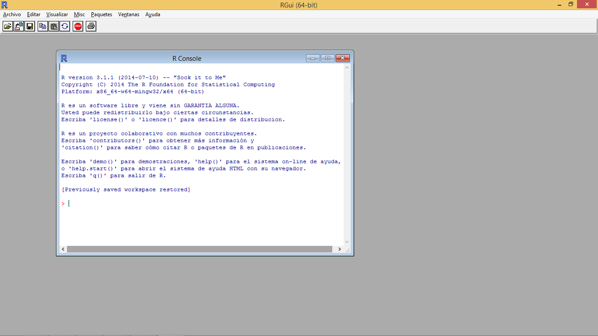

<figcaption>R standard terminal</figcaption>
</figure>

<figure class="figure">

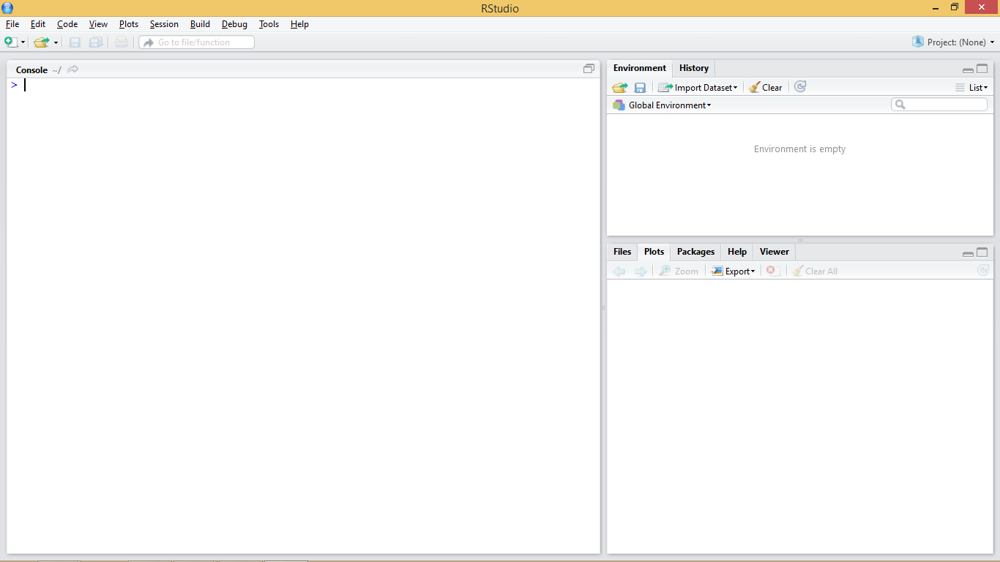

<figcaption>RStudio interface</figcaption>
</figure>

<figure class="figure">

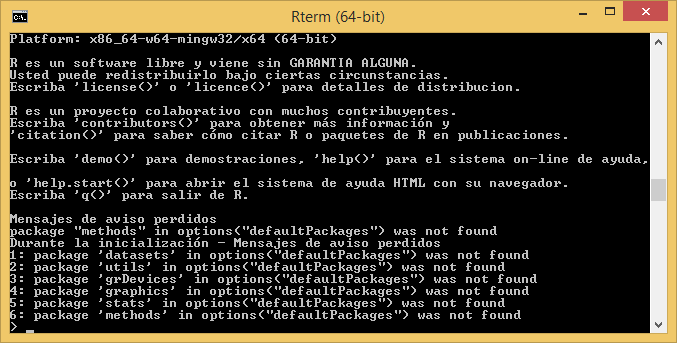

<figcaption>R code terminal</figcaption>
</figure>

The terminal (regardless of the chosen option) is usually the main working window and is where we will introduce the necessary instructions to carry out our operations. It is in this window where we will visualize the results from most instructions and objects we generate. An exception to this are plots and maps which are displayed in a specifically-devoted window located in the bottom-right corner.

</section>
</section>
<section id="working-with-r" class="level2" data-number="2.3">
<h2 data-number="2.3" class="anchored" data-anchor-id="working-with-r">2.3 Working with R</h2>

Let’s get started and insert our first command in the R’s terminal. When R is ready or awaiting us to input an instruction the terminal shows a cursor right after a <em>&gt;</em> symbol to indicate it.

<figure class="figure">

<figcaption>R waiting for sintructions</figcaption>
</figure>

At this point it is necessary to take into account that R is an interpreted language, which means that the different instructions or functions that we specify are read and executed one by one. The procedure is more or less as follows. We introduce an instruction in the R console, the application interprets and executes it, and finally generates or returns the result.

To better understand this concept we will do a little test using the R console as a calculator. Open the working environment of RStudio if you did not already open it and enter the following statement and press enter:

<pre class="sourceCode r code-with-copy"><code class="sourceCode r">10+2</code><button title="Copy to Clipboard" class="code-copy-button"><i class="bi"></i></button></pre>

<pre><code>[1] 12</code></pre>

What just happened is that the R interpreter has read the instruction, in this case a simple arithmetic operation, executed it and returned the result. This is the basic way to proceed to enter operations. However, it will not be necessary for us to always enter the instructions manually. Later we will see how to create scripts or introduce blocks of instructions.

</section>
<section id="objects-in-r" class="level2" data-number="2.4">
<h2 data-number="2.4" class="anchored" data-anchor-id="objects-in-r">2.4 Objects in R</h2>

We have previously mentioned some features of R such as that R is an object-oriented language. But, what does this mean? It basically means that to perform any type of task we use objects. Everything in R is an object (functions, variables, results …). Thus, entities that are created and manipulated in R are called objects, including data, functions and other structures.

Objects are stored and characterized by their name and content. Depending on the type of object we create that object will have a given set of characteristics. Generally the first objects one creates are those of variable type, in which we will be able to store a piece of data and information. The main objects of variable type in R are:

<ul>
<li>
Number: an integer or decimal number depending on whether we specify decimal figures.
</li>
<li>
Factor:a categorical variable or text.
</li>
<li>
Vector: a list of values of the same type.
</li>
<li>
Array: a vector of k dimensions.
</li>
<li>
Matrix: a particular case of array where k=2 (rows, cols).
</li>
<li>
Data.frame: table composed of vectors.
</li>
<li>
List: vector with values of different types.
</li>
</ul>

Obviously there are other types of objects in R. For example, another object with which we are going to familiarize ourselves is the <em>model</em> objects. We can create them by storing the output of executing some kind of model like a linear regression model for instance. Spatial data also fits in its particular variety of objects. Through the course we will see both models and spatial information (vector and raster).

<section id="creating-objects" class="level3" data-number="2.4.1">
<h3 data-number="2.4.1" class="anchored" data-anchor-id="creating-objects">2.4.1 Creating objects</h3>

Objects in R are created by declaring a variable by specifying its name and then assign it a value using the <code>&lt;-</code> operator. We can also use <code>=</code> but the <code>&lt;-</code> operator is most commonly found in examples and manuals.

So, to create an object and assign it a value the basic instruction is composed of <code>object name &lt;- value</code>.

<pre class="sourceCode r code-with-copy"><code class="sourceCode r">n &lt;- 4</code><button title="Copy to Clipboard" class="code-copy-button"><i class="bi"></i></button></pre>

Try to introduce the following instructions to create different kind of objects:

<pre class="sourceCode r code-with-copy"><code class="sourceCode r">n &lt;- 15
x &lt;- 1.0
name &lt;- "Marcos"</code><button title="Copy to Clipboard" class="code-copy-button"><i class="bi"></i></button></pre>

We can also store in an object the result form any operation:

<pre class="sourceCode r code-with-copy"><code class="sourceCode r">n &lt;- 10+2</code><button title="Copy to Clipboard" class="code-copy-button"><i class="bi"></i></button></pre>

So here is the thing. The type of object we create depends on the content that we assign. Therefor, if we assign a numeric value, we are creating an object of type number (integer or decimal) and if we assign a text string (any quoted text, either with single or double quotes), we are creating a text type object or string. Once created, the objects are visualized using calls using the name that we have assigned to the object. That is, we will write to the terminal in the name of the object and then its value will be shown.

<pre class="sourceCode r code-with-copy"><code class="sourceCode r">n</code><button title="Copy to Clipboard" class="code-copy-button"><i class="bi"></i></button></pre>

<pre><code>[1] 12</code></pre>

<pre class="sourceCode r code-with-copy"><code class="sourceCode r">name</code><button title="Copy to Clipboard" class="code-copy-button"><i class="bi"></i></button></pre>

<pre><code>[1] "Marcos"</code></pre>

Some considerations to keep in mind when creating objects or working with R in general lines:

<ol type="1">
<li>
R is <strong>case-sensitive</strong> so radio ≠ Radio
</li>
<li>
If a new value is assigned to an object it is overwritten and <strong>deletes the previous value</strong>.
</li>
<li>
Textual information (also known as string or char) is entered between quotation marks, either single (<code>''</code>) or double (<code>""</code>).
</li>
<li>
The function <code>ls()</code> will show us in the terminal the objects created so far.
</li>
<li>
If the value obtained from an instruction is not assigned in an object it is only displayed in the terminal, it is not stored.
</li>
</ol>
</section>
<section id="vectors" class="level3" data-number="2.4.2">
<h3 data-number="2.4.2" class="anchored" data-anchor-id="vectors">2.4.2 Vectors</h3>

One of the most common objects in R is the vector. A vector can store several values, which must necessarily be of the same type (all numbers, all text, and so forth). There are several ways to create vectors. Try entering the following instructions and viewing the created objects.

<pre class="sourceCode r code-with-copy"><code class="sourceCode r">v1 &lt;- c(1,2,3,4,5)
v1</code><button title="Copy to Clipboard" class="code-copy-button"><i class="bi"></i></button></pre>

<pre><code>[1] 1 2 3 4 5</code></pre>

<pre class="sourceCode r code-with-copy"><code class="sourceCode r">v2 &lt;- 1:10</code><button title="Copy to Clipboard" class="code-copy-button"><i class="bi"></i></button></pre>

<pre class="sourceCode r code-with-copy"><code class="sourceCode r">v3 &lt;- -5:3
v3</code><button title="Copy to Clipboard" class="code-copy-button"><i class="bi"></i></button></pre>

<pre><code>[1] -5 -4 -3 -2 -1  0  1  2  3</code></pre>

<pre class="sourceCode r code-with-copy"><code class="sourceCode r">v4 &lt;- c('spatial','statistics','rules!!')
v4</code><button title="Copy to Clipboard" class="code-copy-button"><i class="bi"></i></button></pre>

<pre><code>[1] "spatial"    "statistics" "rules!!"   </code></pre>

We have just covered the basic methods for vector creation. The most common approach is use the function&nbsp;<code>c()</code>&nbsp;which allow as to introduce values manually by separatting them using&nbsp;<code>,</code>.

<pre class="sourceCode r code-with-copy"><code class="sourceCode r">v1 &lt;- c(1, 2, 3, 4, 5)
v1</code><button title="Copy to Clipboard" class="code-copy-button"><i class="bi"></i></button></pre>

<pre><code>[1] 1 2 3 4 5</code></pre>

<pre class="sourceCode r code-with-copy"><code class="sourceCode r">v4 &lt;- c('spatial','statistics','rules!!')
v4</code><button title="Copy to Clipboard" class="code-copy-button"><i class="bi"></i></button></pre>

<pre><code>[1] "spatial"    "statistics" "rules!!"   </code></pre>

Another option that only works for vectors containing integer values is the use of&nbsp;<code>:</code>&nbsp;which produces a ordered sequence of numbers by adding 1 starting from the first value and finishing in the last.

<pre class="sourceCode r code-with-copy"><code class="sourceCode r">v2 &lt;- 1:10</code><button title="Copy to Clipboard" class="code-copy-button"><i class="bi"></i></button></pre>

<pre class="sourceCode r code-with-copy"><code class="sourceCode r">v3 &lt;- -5:3
v3</code><button title="Copy to Clipboard" class="code-copy-button"><i class="bi"></i></button></pre>

<pre><code>[1] -5 -4 -3 -2 -1  0  1  2  3</code></pre>

Vectors, lists, arrays, and data frames are indexed objects. This means that they store several values and assign to each of them a numerical index that indicates their position within the object. We can access the information stored in each of the positions by using&nbsp;<code>name[position]</code>:

<pre class="sourceCode r code-with-copy"><code class="sourceCode r">v1[1]</code><button title="Copy to Clipboard" class="code-copy-button"><i class="bi"></i></button></pre>

<pre><code>[1] 1</code></pre>

Note that opposite to most of the other programming languages, the index for the first position in an indexed object is 1, whereas Python, C++ and others use 0.

As with an unindexed object, it is possible to modify the information of a particular position using the combination <code>name[position]</code> and the assignment operator <code>&lt;-</code>. For example:

<pre class="sourceCode r code-with-copy"><code class="sourceCode r">v3[9] &lt;- 1000000
v3[9]</code><button title="Copy to Clipboard" class="code-copy-button"><i class="bi"></i></button></pre>

<pre><code>[1] 1e+06</code></pre>

Let’s see some specific functions and basic operations for vectors and other indexed objects:

<ul>
<li>
<code>length(vector)</code>: Returns the number of positions of a vector.
</li>
<li>
Logical operators <code>&lt;,&gt;, ==,!=</code>: Applying these operators on a vector returns a new vector with values TRUE/FALSE for each of the positions of the vector, depending on whether the given values satisfies or not the condition.
</li>
</ul>

<pre class="sourceCode r code-with-copy"><code class="sourceCode r">length(v3)</code><button title="Copy to Clipboard" class="code-copy-button"><i class="bi"></i></button></pre>

<pre><code>[1] 9</code></pre>

<pre class="sourceCode r code-with-copy"><code class="sourceCode r">v4&lt;-1:5
v4&gt;3</code><button title="Copy to Clipboard" class="code-copy-button"><i class="bi"></i></button></pre>

<pre><code>[1] FALSE FALSE FALSE  TRUE  TRUE</code></pre>

</section>
<section id="lists" class="level3" data-number="2.4.3">
<h3 data-number="2.4.3" class="anchored" data-anchor-id="lists">2.4.3 Lists</h3>

Once we have seen vectors we go to explore how objects of type list work. A list is an object similar to a vector with the difference that lists allow to store values of different type. Lists are created using the <code>list(value1, value2, ...)</code> function. For example:

<pre class="sourceCode r code-with-copy"><code class="sourceCode r">list1 &lt;- list(1,7,"Marcos")
list1</code><button title="Copy to Clipboard" class="code-copy-button"><i class="bi"></i></button></pre>

<pre><code>[[1]]
[1] 1

[[2]]
[1] 7

[[3]]
[1] "Marcos"</code></pre>

To access the values stored in the different positions proceed in the same way we did with vectors, ie&nbsp;<code>name[position]</code>:

<pre class="sourceCode r code-with-copy"><code class="sourceCode r">list1[3]</code><button title="Copy to Clipboard" class="code-copy-button"><i class="bi"></i></button></pre>

<pre><code>[[1]]
[1] "Marcos"</code></pre>

We can use the&nbsp;<code>length()</code>&nbsp;function with list too:

<pre class="sourceCode r code-with-copy"><code class="sourceCode r">length(list1)</code><button title="Copy to Clipboard" class="code-copy-button"><i class="bi"></i></button></pre>

<pre><code>[1] 3</code></pre>

</section>
<section id="arrays" class="level3" data-number="2.4.4">
<h3 data-number="2.4.4" class="anchored" data-anchor-id="arrays">2.4.4 Arrays</h3>

Arrays are an extension of vectors, which add additional dimensions to store information. The most common case is the 2-dimensional matrix (rows and columns). To create an array, we use <code>array(values, dimensions)</code>. Both <code>values</code> and <code>dimensions</code> are specified using vectors. In the following example we see how to create a matrix with 4 rows and 5 columns, thus containing 20 values, in this case correlative numbers from 1 to 20:

<pre class="sourceCode r code-with-copy"><code class="sourceCode r">myarray&lt;- array(1:20,dim=c(4,5))
myarray</code><button title="Copy to Clipboard" class="code-copy-button"><i class="bi"></i></button></pre>

<pre><code>     [,1] [,2] [,3] [,4] [,5]
[1,]    1    5    9   13   17
[2,]    2    6   10   14   18
[3,]    3    7   11   15   19
[4,]    4    8   12   16   20</code></pre>

To access the stored values we will use a combination of row-and-column positions like&nbsp;<code>matrix[row, col]</code>, where&nbsp;<code>row</code>&nbsp;indicates the row postition and&nbsp;<code>col</code>&nbsp;the column one. If we only assign value to one of the coordinates (<code>[row,]</code>&nbsp;or&nbsp;<code>[,col]</code>) we get the vector corresponding to the specified row or column.

<pre class="sourceCode r code-with-copy"><code class="sourceCode r">myarray[3,2]</code><button title="Copy to Clipboard" class="code-copy-button"><i class="bi"></i></button></pre>

<pre><code>[1] 7</code></pre>

<pre class="sourceCode r code-with-copy"><code class="sourceCode r">myarray[3,]</code><button title="Copy to Clipboard" class="code-copy-button"><i class="bi"></i></button></pre>

<pre><code>[1]  3  7 11 15 19</code></pre>

<pre class="sourceCode r code-with-copy"><code class="sourceCode r">myarray[,2]</code><button title="Copy to Clipboard" class="code-copy-button"><i class="bi"></i></button></pre>

<pre><code>[1] 5 6 7 8</code></pre>

</section>
<section id="data.frame" class="level3" data-number="2.4.5">
<h3 data-number="2.4.5" class="anchored" data-anchor-id="data.frame">2.4.5 Data.frame</h3>

A data frame is used for storing data tables. It is a list of vectors of equal length. For example, the following variable df is a data frame containing three vectors <code>n</code>, <code>s</code>, <code>b</code>.

<pre class="sourceCode r code-with-copy"><code class="sourceCode r">n &lt;- c(2, 3, 5) 
s &lt;- c("aa", "bb", "cc") 
b &lt;- c(TRUE, FALSE, TRUE) 
df &lt;- data.frame(n, s, b)</code><button title="Copy to Clipboard" class="code-copy-button"><i class="bi"></i></button></pre>

As you can see, the function&nbsp;<code>data.frame()</code>&nbsp;is used to create the data.frame. However, we will seldom use these function to create objects or store data. Normally, we will call an instruction to read text files containing data or call data objects available in some packages.

</section>
</section>
<section id="object-management" class="level2" data-number="2.5">
<h2 data-number="2.5" class="anchored" data-anchor-id="object-management">2.5 Object management</h2>

We have seen so far aspects related to the creation of objects. However we should be also know how many objects we have created in our session and how to remove them if necessary. To display all created objects we use <code>ls()</code>. Deleting objects in R is done by the command <em>remove</em> <code>rm(object)</code> and then call to the <em>garbage collector</em> with <code>gc()</code> to free-up the occupied memory.

<pre class="sourceCode r code-with-copy"><code class="sourceCode r">ls()</code><button title="Copy to Clipboard" class="code-copy-button"><i class="bi"></i></button></pre>

<pre><code> [1] "b"       "df"      "list1"   "myarray" "n"       "name"    "s"      
 [8] "v1"      "v2"      "v3"      "v4"      "x"      </code></pre>

If we want to removal&nbsp;<strong>all</strong>&nbsp;the objects we have currently in our working session we can pass a&nbsp;<code>list</code>&nbsp;object containing the names of all objects to the&nbsp;<code>gc()</code>&nbsp;function. If you are thinking on combining&nbsp;<code>gc()</code>and&nbsp;<code>ls()</code>you are right. This would be the way:

<pre class="sourceCode r code-with-copy"><code class="sourceCode r">rm(list=ls())
gc()</code><button title="Copy to Clipboard" class="code-copy-button"><i class="bi"></i></button></pre>

<pre><code>          used (Mb) gc trigger (Mb) max used (Mb)
Ncells  589897 31.6    1256704 67.2  1256704 67.2
Vcells 1106909  8.5    8388608 64.0  1794756 13.7</code></pre>

</section>
<section id="functions-and-arguments" class="level2" data-number="2.6">
<h2 data-number="2.6" class="anchored" data-anchor-id="functions-and-arguments">2.6 Functions and arguments</h2>

Up to this point we have seen and executed some instructions in R, generally oriented to the creation of objects or realization of simple arithmetic operations.

However, we have also executed some function-type statements, such as the <code>length()</code> function. A function can be defined as a group of instructions that takes an input, uses this input to compute other values and returns a result or product. We will not go into very deep details, at least for now. It suffices to know that to execute a function it is enough to invoke the instruction that calls the desired function (<code>length</code>) and to specify the necessary inputs, also known as <em>arguments</em>. These inputs are always included between the parentheses of the instruction (<code>length(vector)</code>). If several arguments are needed we separate them using <code>,</code>.

Sometimes we can refer to a given argument by using the argument’s name as is the case of the example we saw to delete all the objects in a session <code>rm(list=ls())</code>.

</section>
<section id="scripts-in-r" class="level2" data-number="2.7">
<h2 data-number="2.7" class="anchored" data-anchor-id="scripts-in-r">2.7 Scripts in R</h2>

So far we have inserted instructions in the console but this is not the most efficient way to work. We will focus on the use of scripts which are an <strong>ordered set of instructions</strong>. This means we can write a text file with the instructions we want to insert and then run them at once.

RStudio has an script development environment which opens in the top-left window. We can access the scripting window pressing <em>File/New File/R script</em>.

For additional information visit the <a href="https://support.rstudio.com/hc/en-us/articles/200484448-Editing-and-Executing-Code">RStudio support site</a>.

</section>
<section id="working-with-files" class="level2" data-number="2.8">
<h2 data-number="2.8" class="anchored" data-anchor-id="working-with-files">2.8 Working with files</h2>

So far we have seen how to enter data and create objects manually, but it is also possible, and in fact is most common, to read data from files and store it in an object. If the target data file is properly structured, we will create a <code>matrix</code> or a ‘data.frame’ object which we can manipulated afterwards.

<section id="the-working-directory" class="level3" data-number="2.8.1">
<h3 data-number="2.8.1" class="anchored" data-anchor-id="the-working-directory">2.8.1 The working directory</h3>

Using data files normally requires us to specify the location of that file using <code>paths</code>. To avoid this, R has a tool that allow us to specify a target folder -the so-called <strong>working directory or folder</strong>- to work with.

The working directory is the default path for reading and writing files of any kind. We can know the path to the current working directory using the <code>getwd()</code> command. To set a new working directory, we use the command <code>setwd("path")</code>. Remember that <code>setwd()</code> requires a <code>string</code> argument (whereas <code>getwd()</code> does not) to specify the path to the working directory (“path”).

<pre class="sourceCode r code-with-copy"><code class="sourceCode r">getwd()
setwd('C:/Users/Marcos/Desktop/')
getwd()</code><button title="Copy to Clipboard" class="code-copy-button"><i class="bi"></i></button></pre>

By default, in Windows the working directory is set to the <strong>Documents</strong> folder.

Once the working directory is specified, everything we do in R (read files, export tables and/or graphics …) will be done in that directory. However, it is possible to work with other file system locations, specifying a different path through the arguments of some functions.

</section>
<section id="reading-data-files" class="level3" data-number="2.8.2">
<h3 data-number="2.8.2" class="anchored" data-anchor-id="reading-data-files">2.8.2 Reading data files</h3>

R allows you to read any type of file in ASCII format (text files). The most frequently used functions are:

<ul>
<li>
<code>read.table()</code> and its different variations
</li>
<li>
<code>scan()</code>
</li>
<li>
<code>read.fwf()</code>
</li>
</ul>

For the development of this course we will focus on using the <code>read.table()</code> function as it is quite versatile and easy to use. Before starting to use a new function we should always take a look at the available documentation. we will take this opportunity to show you how to do this in R so that you begin to become familiar R help.

Any available function in R, regardless of being a standard one or belonging to an imported package has a documentation entry in the R help. R help describes us in detail the use of any function, providing information of the different arguments of the function, argument types, defaults, reference to the method (when applies) and even short code examples. To access the help we will use the <code>help()</code> function as follows:

<pre class="sourceCode r code-with-copy"><code class="sourceCode r">help(read.table)</code><button title="Copy to Clipboard" class="code-copy-button"><i class="bi"></i></button></pre>

Entering the&nbsp;<code>help()</code>&nbsp;function we access the manual. In this case we can see a brief description of the function&nbsp;<code>read.table()</code>&nbsp;and its different variants (<code>read.csv()</code>, …). Below is the description of the arguments of the function, followed by some examples of application. This is the usual procedure for all functions available in R.

<figure class="figure">

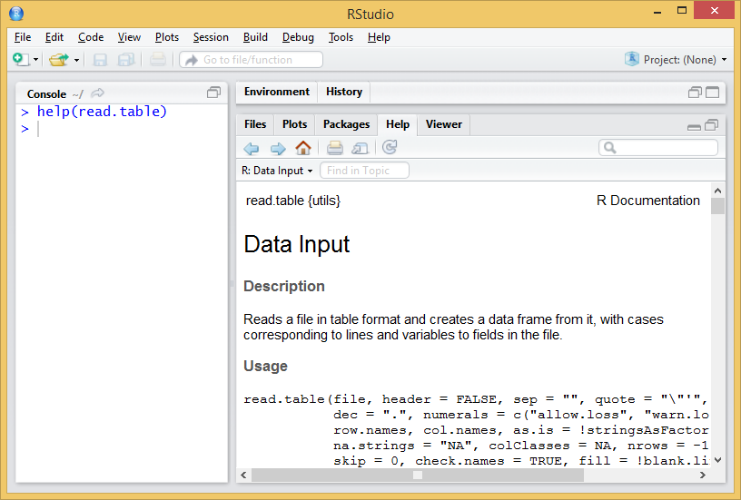

<figcaption>Help example</figcaption>
</figure>

In case we use the regular R interface or the <em>cmd</em> terminal, the help entry will open in our default web browser.

At first glance the <code>read.table()</code> function seems to require many arguments, while its variations seem simpler. As already mentioned, arguments are just parameters that we can specify or change to execute a function, thus <em>tunning</em> the operation of the functions and the result to be obtained.

Arguments are specified within the function separated by commas (“,”). However, it is not necessary to assign a value to each one of them, since in the case of omitting an argument it is assigned a default value (always reported in the help entry). In the case of <code>read.table()</code> <em>versus</em> other functions like <code>read.csv()</code> the main advantage of using the first is that we can manipulate any argument, whereas most of them are fixed in the later. <code>read.csv()</code> is desigend to open comma separate files following the north-american standard (<code>,</code> as field delimiter and <code>.</code> as decimal separator). On the other hand, <code>read.table()</code> can potentially open any text file regardless of the separator, encoding, decimal format and so on so forth. Most of the executions of <code>read.table()</code> consist of:

<strong>💡read.table(file,header=TRUE, sep=“,”,dec=“.”)</strong>

<ul>
<li>
file: path and name of the file to open.
</li>
<li>
header: TRUE/FALSE argument to determine whether the first row of the data file contains column names.
</li>
<li>
sep: field or column separator<a href="#fn4" class="footnote-ref" id="fnref4" role="doc-noteref">4</a>.
</li>
<li>
dec: decimal separator.
</li>
</ul>

Let’s see an example of reading file. We will read the file <em>coordinates.txt</em>, located in the Data directory. The file is structured in 3 columns with heading and separated by “;”. Al data are integer so no decimal separator is needed. See Table 2.2.

<table class="caption-top table table-sm table-striped small">
<caption>Structure of the coordinates.txt file.</caption>
<thead>
<tr class="header">
<th style="text-align: right;">FID_1</th>
<th style="text-align: right;">X_INDEX</th>
<th style="text-align: right;">Y_INDEX</th>
</tr>
</thead>
<tbody>
<tr class="odd">
<td style="text-align: right;">364011</td>
<td style="text-align: right;">82500</td>
<td style="text-align: right;">4653500</td>
</tr>
<tr class="even">
<td style="text-align: right;">371655</td>
<td style="text-align: right;">110500</td>
<td style="text-align: right;">4661500</td>
</tr>
<tr class="odd">
<td style="text-align: right;">487720</td>
<td style="text-align: right;">55500</td>
<td style="text-align: right;">4805500</td>
</tr>
<tr class="even">
<td style="text-align: right;">474504</td>
<td style="text-align: right;">28500</td>
<td style="text-align: right;">4783500</td>
</tr>
<tr class="odd">
<td style="text-align: right;">436415</td>
<td style="text-align: right;">85500</td>
<td style="text-align: right;">4729500</td>
</tr>
<tr class="even">
<td style="text-align: right;">457549</td>
<td style="text-align: right;">38500</td>
<td style="text-align: right;">4757500</td>
</tr>
<tr class="odd">
<td style="text-align: right;">469377</td>
<td style="text-align: right;">39500</td>
<td style="text-align: right;">4775500</td>
</tr>
<tr class="even">
<td style="text-align: right;">397162</td>
<td style="text-align: right;">124500</td>
<td style="text-align: right;">4687500</td>
</tr>
<tr class="odd">
<td style="text-align: right;">434666</td>
<td style="text-align: right;">41500</td>
<td style="text-align: right;">4727500</td>
</tr>
<tr class="even">
<td style="text-align: right;">478383</td>
<td style="text-align: right;">49500</td>
<td style="text-align: right;">4789500</td>
</tr>
<tr class="odd">
<td style="text-align: right;">488973</td>
<td style="text-align: right;">329500</td>
<td style="text-align: right;">4807500</td>
</tr>
<tr class="even">
<td style="text-align: right;">394153</td>
<td style="text-align: right;">77500</td>
<td style="text-align: right;">4684500</td>
</tr>
<tr class="odd">
<td style="text-align: right;">426962</td>
<td style="text-align: right;">36500</td>
<td style="text-align: right;">4718500</td>
</tr>
<tr class="even">
<td style="text-align: right;">362216</td>
<td style="text-align: right;">148500</td>
<td style="text-align: right;">4651500</td>
</tr>
</tbody>
</table>

The process to follow is:

<ol type="1">
<li>
Set working directory.
</li>
<li>
Use the function to save the data in an object.
</li>
</ol>

If we do…

<pre class="sourceCode r code-with-copy"><code class="sourceCode r">setwd('.C/Users/Pere/INTRO_R/')
read.table('./data/Module_1/coordinates.txt',header=TRUE,sep=';')</code><button title="Copy to Clipboard" class="code-copy-button"><i class="bi"></i></button></pre>

…as we have not specified any object in which to store the result of the function, the contents of the file are simply printed on the terminal. This is a usual mistake, don’t worry. To store and later access the contents of the file we will do the following:

<pre class="sourceCode r code-with-copy"><code class="sourceCode r">table&lt;-read.table('./data/Module_1/coordinates.txt',header=TRUE,sep=';')
table</code><button title="Copy to Clipboard" class="code-copy-button"><i class="bi"></i></button></pre>

<pre><code>    FID_1 X_INDEX Y_INDEX
1  364011   82500 4653500
2  371655  110500 4661500
3  487720   55500 4805500
4  474504   28500 4783500
5  436415   85500 4729500
6  457549   38500 4757500
7  469377   39500 4775500
8  397162  124500 4687500
9  434666   41500 4727500
10 478383   49500 4789500
11 488973  329500 4807500
12 394153   77500 4684500
13 426962   36500 4718500
14 362216  148500 4651500</code></pre>

Please note that:

<ul>
<li>
You have to specify your own working directory.
</li>
<li>
The path to the directory is specified in text format, so you type <strong>“in quotation marks”</strong>.
</li>
<li>
The name of the file to be read is also specified as text.
</li>
<li>
The header argument only accepts TRUE or FALSE values.
</li>
<li>
The <code>sep</code> argument also requires text values to enter the separator<a href="#fn5" class="footnote-ref" id="fnref5" role="doc-noteref">5</a>.
</li>
<li>
It is advisable to save the data an object (table &lt;-).
</li>
</ul>

The result of <code>read.table()</code> is an <code>array</code> stored in an object named <code>table</code>. Since <code>read.table()</code> returns an <code>array</code> we can manipulate our <code>table</code> using the same procedure described in the @ref(arrays) section.

<pre class="sourceCode r code-with-copy"><code class="sourceCode r">table[,1]</code><button title="Copy to Clipboard" class="code-copy-button"><i class="bi"></i></button></pre>

<pre><code> [1] 364011 371655 487720 474504 436415 457549 469377 397162 434666 478383
[11] 488973 394153 426962 362216</code></pre>

<pre class="sourceCode r code-with-copy"><code class="sourceCode r">table[1,1]</code><button title="Copy to Clipboard" class="code-copy-button"><i class="bi"></i></button></pre>

<pre><code>[1] 364011</code></pre>

Below we found some interesting functions to preview and verify the information, and to know the structure of the data we have just imported. These functions are normally used to take a quick look into the first and last rows of an <code>array</code> or <code>data.frame</code> object and also to describe the structure of a given object.

<ul>
<li>
<code>head()</code>: displays the first rows of the array.
</li>
<li>
<code>tail()</code>: displays the last rows of the array.
</li>
<li>
<code>str()</code>: displays the structure and data type (factor or number).
</li>
</ul>

<pre class="sourceCode r code-with-copy"><code class="sourceCode r">head(table)</code><button title="Copy to Clipboard" class="code-copy-button"><i class="bi"></i></button></pre>

<pre><code>   FID_1 X_INDEX Y_INDEX
1 364011   82500 4653500
2 371655  110500 4661500
3 487720   55500 4805500
4 474504   28500 4783500
5 436415   85500 4729500
6 457549   38500 4757500</code></pre>

<pre class="sourceCode r code-with-copy"><code class="sourceCode r">tail(table)</code><button title="Copy to Clipboard" class="code-copy-button"><i class="bi"></i></button></pre>

<pre><code>    FID_1 X_INDEX Y_INDEX
9  434666   41500 4727500
10 478383   49500 4789500
11 488973  329500 4807500
12 394153   77500 4684500
13 426962   36500 4718500
14 362216  148500 4651500</code></pre>

<pre class="sourceCode r code-with-copy"><code class="sourceCode r">str(table)</code><button title="Copy to Clipboard" class="code-copy-button"><i class="bi"></i></button></pre>

<pre><code>'data.frame':   14 obs. of  3 variables:
 $ FID_1  : int  364011 371655 487720 474504 436415 457549 469377 397162 434666 478383 ...
 $ X_INDEX: int  82500 110500 55500 28500 85500 38500 39500 124500 41500 49500 ...
 $ Y_INDEX: int  4653500 4661500 4805500 4783500 4729500 4757500 4775500 4687500 4727500 4789500 ...</code></pre>

As already mentioned, <code>read.table()</code> is adequate to start reading of files to incorporate data into our working session in R. In any case we must be aware that there are other possibilities such as the <code>read.csv()</code> and <code>read.csv2()</code> that we have already seen when accessing the <code>read.table()</code> description. These functions are variations that defaults some arguments such as the field separator (columns) or the decimal character. In the help of the function you have information about it.

</section>
<section id="writing-text-files" class="level3" data-number="2.8.3">
<h3 data-number="2.8.3" class="anchored" data-anchor-id="writing-text-files">2.8.3 Writing text files</h3>

Of course, we can also write text files from our data. The procedure is quite similar to read data but using <code>write.table()</code> instead of <code>read.table</code>. Remember that the created files are saved into the working directory, unless you specify an alternative path in the function arguments. As always, before starting the first thing is to consult the help of the function.

<pre class="sourceCode r code-with-copy"><code class="sourceCode r">help("write.table")</code><button title="Copy to Clipboard" class="code-copy-button"><i class="bi"></i></button></pre>

The arguments of the function are similar to those already seen in <code>read.table ()</code>:

<strong>💡write.table(object,file,names,sep)</strong>

<ul>
<li>
<code>object</code>: object of type matrix (or dataframe) to write.
</li>
<li>
<code>file</code>: name and path to the created file (in text format).
</li>
<li>
<code>row.names</code>: add or not (TRUE or FALSE) queue names. FALSE is recommended.
</li>
<li>
<code>sep</code>: column separator (in text format).
</li>
<li>
<code>dec</code>: decimal separator (in text format).
</li>
</ul>

Try the following instructions<a href="#fn6" class="footnote-ref" id="fnref6" role="doc-noteref">6</a> and observe the different results:

<pre class="sourceCode r code-with-copy"><code class="sourceCode r">write.table(table,'table1.txt',row.names=TRUE,sep='\t')
write.table(table,'table2.txt',row.names=FALSE,sep='\t')
write.table(table,'table3.txt',row.names=FALSE,sep=';')
write.table(table,'your path/table4.txt',sep=';')
write.csv(table,'your path/table5.csv')</code><button title="Copy to Clipboard" class="code-copy-button"><i class="bi"></i></button></pre>

</section>
<section id="data-manipulation" class="level3" data-number="2.8.4">
<h3 data-number="2.8.4" class="anchored" data-anchor-id="data-manipulation">2.8.4 Data manipulation</h3>

Let’s see the most common instructions for manipulating and extracting information in R. Specifically we will see how to extract subsets of data from objects of type <code>vector</code>, <code>array</code> or <code>dataframe</code>. We will also see how to create new data sets from the aggregation of several objects. There are many commands that allow us to manipulate our data in R. Many things can be understood as <em>manipulation</em> but for the moment we will focus on:

<ul>
<li>
Select or extract information
</li>
<li>
Sort tables
</li>
<li>
Add rows or columns to a table
</li>
</ul>

As you might already guess, we will work with tabular data like <code>arrays</code> and <code>data.frames</code> which we further refer to as <strong>tables</strong>.

<section id="working-with-columns" class="level4" data-number="2.8.4.1">
<h4 data-number="2.8.4.1" class="anchored" data-anchor-id="working-with-columns">2.8.4.1 Working with columns</h4>

The first thing we will do is access the information stored in the column(s) of a given table object. There are two basic ways to do this:

<ol type="1">
<li>
Using the position index of the column.
</li>
<li>
Using the name (header) of the column.
</li>
</ol>

These two basic forms are not always interchangeable, so we will use one or the other depending on the case. It is recommended that you use the one that feels most comfortable for you. However, in most examples the column position index is used since it is a numerical value that is very easily integrated with loops and other iterative processes.

<section id="extracting-columns" class="level5" data-number="2.8.4.1.1">
<h5 data-number="2.8.4.1.1" class="anchored" data-anchor-id="extracting-columns">2.8.4.1.1 Extracting columns</h5>

To extract columns using the position index we will use a series of instructions similar to those already seen in extracting information from <a href="https://intro-r-module-1.netlify.app/intro#arrays">Arrays</a>, <a href="https://intro-r-module-1.netlify.app/intro#vectors">Vectors</a> and <a href="https://intro-r-module-1.netlify.app/intro#lists">Lists</a>. The following statement returns the information of the second column of the <code>array</code> object <code>table</code> and stores it in a new object that we called <code>col2</code>:

<pre class="sourceCode r code-with-copy"><code class="sourceCode r">col2 &lt;- table[,2]
col2</code><button title="Copy to Clipboard" class="code-copy-button"><i class="bi"></i></button></pre>

<pre><code> [1]  82500 110500  55500  28500  85500  38500  39500 124500  41500  49500
[11] 329500  77500  36500 148500</code></pre>

It is also possible to extract a range of columns, proceeding in a similar way to what has already been seen in the creation of vectors. The following statement extracts columns 2 and 3 from the&nbsp;<code>table</code>&nbsp;object and stores them in a new object called&nbsp;<code>cols</code>:

<pre class="sourceCode r code-with-copy"><code class="sourceCode r">cols &lt;- table[,2:3]
cols</code><button title="Copy to Clipboard" class="code-copy-button"><i class="bi"></i></button></pre>

<pre><code>   X_INDEX Y_INDEX
1    82500 4653500
2   110500 4661500
3    55500 4805500
4    28500 4783500
5    85500 4729500
6    38500 4757500
7    39500 4775500
8   124500 4687500
9    41500 4727500
10   49500 4789500
11  329500 4807500
12   77500 4684500
13   36500 4718500
14  148500 4651500</code></pre>

Now let’s see how to select columns using their name. Name extraction is performed using a combination of object and column name object using&nbsp;<code>$</code>&nbsp;to separte&nbsp;<code>object</code>&nbsp;from&nbsp;<code>column name</code>. The following statement selects the column named&nbsp;<code>Y_INDEX</code>&nbsp;from the&nbsp;<code>array</code>&nbsp;object&nbsp;<code>table</code>&nbsp;and stores it in&nbsp;<code>col.Y_INDEX</code>:

<pre class="sourceCode r code-with-copy"><code class="sourceCode r">col.Y_INDEX &lt;- table$Y_INDEX
col.Y_INDEX</code><button title="Copy to Clipboard" class="code-copy-button"><i class="bi"></i></button></pre>

<pre><code> [1] 4653500 4661500 4805500 4783500 4729500 4757500 4775500 4687500 4727500
[10] 4789500 4807500 4684500 4718500 4651500</code></pre>

A key piece of information here is the name of the column which we need to know in advance. Well, we can check the original text file or inspect the object <code>table</code> using <code>str()</code>. We can also take look to the top-right window activaing the <em>Environment</em> sub-window and unwrap <code>table</code> but be aware this can be only accessed using RStudio.

The main difference between these two methods is that index selection makes it possible to extract column ranges easily. To do this using the name of the columns you have to use functions like <code>subset()</code>:

<pre class="sourceCode r code-with-copy"><code class="sourceCode r">cols2 &lt;- subset(table, select = c(X_INDEX,Y_INDEX))</code><button title="Copy to Clipboard" class="code-copy-button"><i class="bi"></i></button></pre>

Using the argument&nbsp;<code>select</code>&nbsp;we can point the columns that we want to extract using a vector with column names. Using&nbsp;<code>subset()</code>&nbsp;it is also possible to specify the columns that we&nbsp;<strong>do NOT want to extract</strong>. To do this proceed as follows:

<pre class="sourceCode r code-with-copy"><code class="sourceCode r">cols2 &lt;- subset(table, select = -c(X_INDEX,Y_INDEX))</code><button title="Copy to Clipboard" class="code-copy-button"><i class="bi"></i></button></pre>

In this way we would only extract the first column, excluding X_INDEX and Y_INDEX. Of cours, we can do this using the column index as well:

<pre class="sourceCode r code-with-copy"><code class="sourceCode r">cols2 &lt;- table[,-(2:3)]</code><button title="Copy to Clipboard" class="code-copy-button"><i class="bi"></i></button></pre>

</section>
<section id="merge-columns-and-tables" class="level5" data-number="2.8.4.1.2">
<h5 data-number="2.8.4.1.2" class="anchored" data-anchor-id="merge-columns-and-tables">2.8.4.1.2 Merge columns and tables</h5>

The main reason why we are learning how to manipulate table columns is to be able to prepare our data for other purposes. It may be the case we need to join tables or columns that proceed from the same original table. The instruction <code>cbind()</code> allow us to merge together several tables and/or vectors <strong>provided they have the same number of rows</strong>. We can merge as many objects as we want to, by separating them using <code>,</code>:

<pre class="sourceCode r code-with-copy"><code class="sourceCode r">cols3 &lt;- cbind(col2,cols2)
cols3</code><button title="Copy to Clipboard" class="code-copy-button"><i class="bi"></i></button></pre>

<pre><code>        col2  cols2
 [1,]  82500 364011
 [2,] 110500 371655
 [3,]  55500 487720
 [4,]  28500 474504
 [5,]  85500 436415
 [6,]  38500 457549
 [7,]  39500 469377
 [8,] 124500 397162
 [9,]  41500 434666
[10,]  49500 478383
[11,] 329500 488973
[12,]  77500 394153
[13,]  36500 426962
[14,] 148500 362216</code></pre>

</section>
<section id="changing-column-names" class="level5" data-number="2.8.4.1.3">
<h5 data-number="2.8.4.1.3" class="anchored" data-anchor-id="changing-column-names">2.8.4.1.3 Changing column names</h5>

It is often the case we need to alter or change the name of a table object. If we wanted to rename all the columns of an object we would to pass a <code>vector</code> with names to the function <code>colnames()</code> in case we are renaming an <code>array</code> or <code>names()</code> if we are dealing with a <code>data.frame</code>. Note that the <code>vector</code> should have the same length as the total number of columns. Lets rename our table <code>cols3</code>:

<pre class="sourceCode r code-with-copy"><code class="sourceCode r">colnames(cols3)&lt;- c("COL1","COL2")</code><button title="Copy to Clipboard" class="code-copy-button"><i class="bi"></i></button></pre>

What if we want to change only a given name. Then we just point to the column header using the position index like this:

<pre class="sourceCode r code-with-copy"><code class="sourceCode r">colnames(cols3)[2]&lt;- "RENAMED COLUMN"</code><button title="Copy to Clipboard" class="code-copy-button"><i class="bi"></i></button></pre>

You may be wondering <em>How can we know what kind of object is my table?</em>. That is a very good question. Specially at the begining is quite difficult to be in control this stuff. If you use RStudio you already see a description of the objects in the top-right window. <code>array</code> or <code>matrix</code> objects show something like <code>[1:14,1:2]</code> indicating multiple dimensions, <code>vectors</code> are similar but with only 1 dimension <code>[1:14]</code> and <code>data.frames</code> show the word <code>data.frame</code> in their description. However, this is not the fancy way to deal with object types. Just for the record, when we mean <strong>type</strong> an actual code developer means <strong>class</strong>. Of course there is a function called <code>class()</code> that returns the class an object belongs to:

<pre class="sourceCode r code-with-copy"><code class="sourceCode r">class(cols3)</code><button title="Copy to Clipboard" class="code-copy-button"><i class="bi"></i></button></pre>

<pre><code>[1] "matrix" "array" </code></pre>

</section>
<section id="sorting-our-data" class="level5" data-number="2.8.4.1.4">
<h5 data-number="2.8.4.1.4" class="anchored" data-anchor-id="sorting-our-data">2.8.4.1.4 Sorting our data</h5>

Finally, let’s look at how to sort columns and <code>arrays</code>. To sort a column in R, the <code>sort()</code> function is used. The general function of the function is:

<pre class="sourceCode r code-with-copy"><code class="sourceCode r">sort(cols3[,1])</code><button title="Copy to Clipboard" class="code-copy-button"><i class="bi"></i></button></pre>

<pre><code> [1]  28500  36500  38500  39500  41500  49500  55500  77500  82500  85500
[11] 110500 124500 148500 329500</code></pre>

If we want to reorder an array based on the values of one of its columns, we will use the order () function. The general operation of the function is:

<pre class="sourceCode r code-with-copy"><code class="sourceCode r">table[order(table$X_INDEX),]</code><button title="Copy to Clipboard" class="code-copy-button"><i class="bi"></i></button></pre>

<pre><code>    FID_1 X_INDEX Y_INDEX
4  474504   28500 4783500
13 426962   36500 4718500
6  457549   38500 4757500
7  469377   39500 4775500
9  434666   41500 4727500
10 478383   49500 4789500
3  487720   55500 4805500
12 394153   77500 4684500
1  364011   82500 4653500
5  436415   85500 4729500
2  371655  110500 4661500
8  397162  124500 4687500
14 362216  148500 4651500
11 488973  329500 4807500</code></pre>

To be honest, in this last example we are actually working with rows. Take a look at the position of the <code>,</code>. The brackets are also something that we will use later to extract data from a table. But it feels right to bring here the <code>order()</code> command right after <code>sort()</code>.

</section>
</section>
<section id="working-with-rows" class="level4" data-number="2.8.4.2">
<h4 data-number="2.8.4.2" class="anchored" data-anchor-id="working-with-rows">2.8.4.2 Working with rows</h4>

Let us now turn to the manipulation of rows. The procedure is basically the same as in the case of columns, except for the fact that we normally do not work with names assigned to rows (although that’s a possibility), but we refer to a row using its position. To extract rows or combine several objects according to their rows we use the following expressions:

<pre class="sourceCode r code-with-copy"><code class="sourceCode r">row1 &lt;- table[1:5,]
row2 &lt;- table[-(6:7),]
row3 &lt;- rbind(row1,row2)</code><button title="Copy to Clipboard" class="code-copy-button"><i class="bi"></i></button></pre>

Same as with <a href="#arrays">Arrays</a> we point to rows instead of columns when we use the index value to the left of the <code>[row,col]</code>. So that’s the thing, we just change that and we are dealing with rows. We can join rows and tables using the <code>rbind()</code> function rather than <code>cbind()</code>. <code>r</code> stands for <code>row</code> and <code>c</code> for <code>column</code>.

We can extract a subsample of rows that meet a given criteria:

<strong>💡table[criteria,]</strong>

<pre class="sourceCode r code-with-copy"><code class="sourceCode r">table[table$X_INDEX==82500,]</code><button title="Copy to Clipboard" class="code-copy-button"><i class="bi"></i></button></pre>

<pre><code>   FID_1 X_INDEX Y_INDEX
1 364011   82500 4653500</code></pre>

<pre class="sourceCode r code-with-copy"><code class="sourceCode r">table[table$X_INDEX&gt;82500,]</code><button title="Copy to Clipboard" class="code-copy-button"><i class="bi"></i></button></pre>

<pre><code>    FID_1 X_INDEX Y_INDEX
2  371655  110500 4661500
5  436415   85500 4729500
8  397162  124500 4687500
11 488973  329500 4807500
14 362216  148500 4651500</code></pre>

Oh, we expect you to have found out this by yourself but evidently we can combine row and column manipulation if that fits our purpose.

</section>
</section>
</section>
<section id="basic-instructions" class="level2" data-number="2.9">
<h2 data-number="2.9" class="anchored" data-anchor-id="basic-instructions">2.9 Basic instructions</h2>
<section id="descriptive-statistics-and-summaries" class="level3" data-number="2.9.1">
<h3 data-number="2.9.1" class="anchored" data-anchor-id="descriptive-statistics-and-summaries">2.9.1 Descriptive statistics and summaries</h3>

There are a large number of functions in the basic installation of R. It would be practically impossible to see all of them so we will see some of the most used, although we must remember that not only is there the possibility of using predesigned functions, but R also offers the possibility to create your own functions.

Below are some of the basic statistical functions that we can find in R. These functions are generally applied <code>matrix-array</code> or <code>data.frame</code> data objects. Some of them can be applied to the whole table and others to single columns or rows.

<ul>
<li>
<code>sum()</code> Add values.
</li>
<li>
<code>max()</code> Returns the maximum value.
</li>
<li>
<code>min()</code> Returns the minimum value.
</li>
<li>
<code>mean()</code> Calculates the mean.
</li>
<li>
<code>median()</code> Returns the median.
</li>
<li>
<code>sd()</code> Calculates the standard deviation.
</li>
<li>
<code>summary()</code> Returns a statistical summary of the columns.
</li>
</ul>

We are going to apply them using some example data. We will use the data stored in the file <em>fires.csv</em>, inside the <em>Data</em> folder (Table 3.1). This file contains data on the annual number of fires between 1985 and 2009 in several European countries.

<pre class="sourceCode r code-with-copy"><code class="sourceCode r">fires &lt;- read.csv2("./data/Module_1/fires.csv",header=TRUE)
knitr::kable(coords,caption = "Structure of the fires.csv file.")</code><button title="Copy to Clipboard" class="code-copy-button"><i class="bi"></i></button></pre>

<table class="caption-top table table-sm table-striped small">
<caption>Structure of the fires.csv file.</caption>
<thead>
<tr class="header">
<th style="text-align: right;">FID_1</th>
<th style="text-align: right;">X_INDEX</th>
<th style="text-align: right;">Y_INDEX</th>
</tr>
</thead>
<tbody>
<tr class="odd">
<td style="text-align: right;">364011</td>
<td style="text-align: right;">82500</td>
<td style="text-align: right;">4653500</td>
</tr>
<tr class="even">
<td style="text-align: right;">371655</td>
<td style="text-align: right;">110500</td>
<td style="text-align: right;">4661500</td>
</tr>
<tr class="odd">
<td style="text-align: right;">487720</td>
<td style="text-align: right;">55500</td>
<td style="text-align: right;">4805500</td>
</tr>
<tr class="even">
<td style="text-align: right;">474504</td>
<td style="text-align: right;">28500</td>
<td style="text-align: right;">4783500</td>
</tr>
<tr class="odd">
<td style="text-align: right;">436415</td>
<td style="text-align: right;">85500</td>
<td style="text-align: right;">4729500</td>
</tr>
<tr class="even">
<td style="text-align: right;">457549</td>
<td style="text-align: right;">38500</td>
<td style="text-align: right;">4757500</td>
</tr>
<tr class="odd">
<td style="text-align: right;">469377</td>
<td style="text-align: right;">39500</td>
<td style="text-align: right;">4775500</td>
</tr>
<tr class="even">
<td style="text-align: right;">397162</td>
<td style="text-align: right;">124500</td>
<td style="text-align: right;">4687500</td>
</tr>
<tr class="odd">
<td style="text-align: right;">434666</td>
<td style="text-align: right;">41500</td>
<td style="text-align: right;">4727500</td>
</tr>
<tr class="even">
<td style="text-align: right;">478383</td>
<td style="text-align: right;">49500</td>
<td style="text-align: right;">4789500</td>
</tr>
<tr class="odd">
<td style="text-align: right;">488973</td>
<td style="text-align: right;">329500</td>
<td style="text-align: right;">4807500</td>
</tr>
<tr class="even">
<td style="text-align: right;">394153</td>
<td style="text-align: right;">77500</td>
<td style="text-align: right;">4684500</td>
</tr>
<tr class="odd">
<td style="text-align: right;">426962</td>
<td style="text-align: right;">36500</td>
<td style="text-align: right;">4718500</td>
</tr>
<tr class="even">
<td style="text-align: right;">362216</td>
<td style="text-align: right;">148500</td>
<td style="text-align: right;">4651500</td>
</tr>
</tbody>
</table>

The first thing is to import the file into a&nbsp;<code>table</code>.

<pre class="sourceCode r code-with-copy"><code class="sourceCode r">fires &lt;- read.table("./data/Module_1/fires.csv",header=TRUE,sep=',')</code><button title="Copy to Clipboard" class="code-copy-button"><i class="bi"></i></button></pre>

Once data is imported we can take a look at the structure to make sure that everything went well. We should have integer values for each region:

<pre class="sourceCode r code-with-copy"><code class="sourceCode r">str(fires)</code><button title="Copy to Clipboard" class="code-copy-button"><i class="bi"></i></button></pre>

<pre><code>'data.frame':   25 obs. of  7 variables:
 $ YEAR    : int  1985 1986 1987 1988 1989 1990 1991 1992 1993 1994 ...
 $ PORTUGAL: int  8441 5036 7705 6131 21896 10745 14327 14954 16101 19983 ...
 $ SPAIN   : int  12238 7570 8679 9247 20811 12913 13531 15955 14254 19263 ...
 $ FRANCE  : int  6249 4353 3043 2837 6763 5881 3888 4002 4769 4618 ...
 $ ITALY   : int  18664 9398 11972 13588 9669 14477 11965 14641 14412 11588 ...
 $ GREECE  : int  1442 1082 1266 1898 1284 1322 858 2582 2406 1763 ...
 $ EUMED   : int  47034 27439 32665 33701 60423 45338 44569 52134 51942 57215 ...</code></pre>

Now we will calculate some descriptive statistics for each column to have a first approximation to the <em>distribution</em> of our data. To do this we will use the function <code>summary()</code> that will return some basic statistical values such as:

<ul>
<li>
Quantile
</li>
<li>
Mean
</li>
<li>
Median
</li>
<li>
Maximum
</li>
<li>
Minimum
</li>
</ul>

<pre class="sourceCode r code-with-copy"><code class="sourceCode r">summary(fires)</code><button title="Copy to Clipboard" class="code-copy-button"><i class="bi"></i></button></pre>

<pre><code>      YEAR         PORTUGAL         SPAIN           FRANCE         ITALY      
 Min.   :1985   Min.   : 5036   Min.   : 7570   Min.   :2781   Min.   : 4601  
 1st Qu.:1991   1st Qu.:14327   1st Qu.:12913   1st Qu.:4002   1st Qu.: 7134  
 Median :1997   Median :21870   Median :16771   Median :4618   Median : 9540  
 Mean   :1997   Mean   :20848   Mean   :16937   Mean   :4907   Mean   : 9901  
 3rd Qu.:2003   3rd Qu.:26488   3rd Qu.:20811   3rd Qu.:6249   3rd Qu.:11965  
 Max.   :2009   Max.   :35697   Max.   :25827   Max.   :8005   Max.   :18664  
     GREECE         EUMED      
 Min.   : 858   Min.   :27439  
 1st Qu.:1322   1st Qu.:45623  
 Median :1486   Median :55215  
 Mean   :1656   Mean   :54249  
 3rd Qu.:1898   3rd Qu.:62399  
 Max.   :2582   Max.   :75382  </code></pre>

The <code>summary()</code> function is not only used to obtain summaries of data through descriptive statistics, but can also be used in model type objects to obtain a statistical summary of the results, coefficients, significance … Later we will see an example of this applied on a linear regression model.

Let’s now see what happens if we apply some of the functions presented above. Try running the following instructions:

<pre class="sourceCode r code-with-copy"><code class="sourceCode r">sum(fires)</code><button title="Copy to Clipboard" class="code-copy-button"><i class="bi"></i></button></pre>

<pre><code>[1] 2762377</code></pre>

<pre class="sourceCode r code-with-copy"><code class="sourceCode r">max(fires)</code><button title="Copy to Clipboard" class="code-copy-button"><i class="bi"></i></button></pre>

<pre><code>[1] 75382</code></pre>

<pre class="sourceCode r code-with-copy"><code class="sourceCode r">min(fires)</code><button title="Copy to Clipboard" class="code-copy-button"><i class="bi"></i></button></pre>

<pre><code>[1] 858</code></pre>

As can be seen these 3 instructions work with a <code>table</code>but <code>mean()</code>, <code>median()</code> and <code>sd()</code> will not. We have to apply them to a single column:

<pre class="sourceCode r code-with-copy"><code class="sourceCode r">mean(fires$SPAIN)</code><button title="Copy to Clipboard" class="code-copy-button"><i class="bi"></i></button></pre>

<pre><code>[1] 16937.24</code></pre>

<pre class="sourceCode r code-with-copy"><code class="sourceCode r">median(fires$SPAIN)</code><button title="Copy to Clipboard" class="code-copy-button"><i class="bi"></i></button></pre>

<pre><code>[1] 16771</code></pre>

<pre class="sourceCode r code-with-copy"><code class="sourceCode r">sd(fires$SPAIN)</code><button title="Copy to Clipboard" class="code-copy-button"><i class="bi"></i></button></pre>

<pre><code>[1] 5260.519</code></pre>

</section>
<section id="the-apply-function" class="level3" data-number="2.9.2">
<h3 data-number="2.9.2" class="anchored" data-anchor-id="the-apply-function">2.9.2 The <em>apply()</em> function</h3>

So far we have seen how to apply some of the basic statistical functions to our data, applying those functions to the data contained in the matrix or some of its columns. In the case of columns we have manually specified which one to apply a function. However, we can apply functions to all elements of an <code>array</code> (columns or rows) using iteration functions.

The <code>apply()</code> function allows you to apply a function to all elements of a table. We can apply some of the functions before the rows or columns of an array. There are different variants of this function. First, as always, invoke the help of the function to make sure what we are doing.

<pre class="sourceCode r code-with-copy"><code class="sourceCode r">help(apply)</code><button title="Copy to Clipboard" class="code-copy-button"><i class="bi"></i></button></pre>

According to the specified in the function help we can see that the apply () function works as follows:

<strong>💡apply(x, margin, fun, …) </strong>

Where:

<ul>
<li>
X: data matrix.
</li>
<li>
MARGIN: argument to specify whether the function is applied to rows (1) or columns (2).
</li>
<li>
FUN: function to be applied (<code>mean</code>,<code>sum</code>…)
</li>
</ul>

For example, if we want to sum the values of each country/region we will do as follows:

<pre class="sourceCode r code-with-copy"><code class="sourceCode r">apply(fires,2,mean)</code><button title="Copy to Clipboard" class="code-copy-button"><i class="bi"></i></button></pre>

<pre><code>    YEAR PORTUGAL    SPAIN   FRANCE    ITALY   GREECE    EUMED 
 1997.00 20848.20 16937.24  4907.16  9900.64  1655.80 54249.04 </code></pre>

Well, almost there. We have included the&nbsp;<em>YEAR</em>&nbsp;column which is the first one:

<pre class="sourceCode r code-with-copy"><code class="sourceCode r">apply(fires[,-1],2,mean)</code><button title="Copy to Clipboard" class="code-copy-button"><i class="bi"></i></button></pre>

<pre><code>PORTUGAL    SPAIN   FRANCE    ITALY   GREECE    EUMED 
20848.20 16937.24  4907.16  9900.64  1655.80 54249.04 </code></pre>

<strong>📝EXERCISE 1: </strong>Calculate the total number of fires on a yearly basis.

<b>Deliverable: </b>

<ol type="1">
<li>Write a text file (<em>.txt</em>) with the result.</li>
</ol>

<strong>📝EXERCISE 2: </strong> Open the file “<em>barea.csv</em>” (<em>file containing Burned Area by year and country</em>) and save it in an object named “<em>barea</em>” - Select and store in a new matrix the data from the year 2000 to 2009. - Calculate descriptive statistics 2000-2009. - Calculate the&nbsp;<em>mean</em>,&nbsp;<em>standard deviation</em>,&nbsp;<em>minimum</em>&nbsp;and&nbsp;<em>maximum</em>&nbsp;of all columns and save it to a new object.

<b>Deliverable: </b>

<ol type="1">
<li>Write a text file (<em>.txt</em>) with the result.</li>
</ol>

<strong> 🪄EXERCISE 2 HINT: </strong>

Use the apply function to calculate each statistic, separately.

</section>
<section id="installing-packages" class="level3" data-number="2.9.3">
<h3 data-number="2.9.3" class="anchored" data-anchor-id="installing-packages">2.9.3 Installing packages</h3>

We have already seen how some of the basic functions of R. work. However, we have the possibility of extending the functionalities of R by importing new packages into our environment. These packages are developed by different research groups and/or individuals.

There are currently over 20015 packages available in the R project repository (<a href="https://cran.r-project.org/web/packages/available_packages_by_name.html">CRAN</a>). Obviously we do not need to know how each one of them works, but only focus on those that fit our needs.

<pre><code>Warning: package 'rvest' was built under R version 4.3.3</code></pre>

<pre><code>Warning: package 'ggplot2' was built under R version 4.3.3</code></pre>

<pre><code>Warning: package 'tidyr' was built under R version 4.3.3</code></pre>

<pre><code>Warning: package 'dplyr' was built under R version 4.3.3</code></pre>

<figure class="figure">

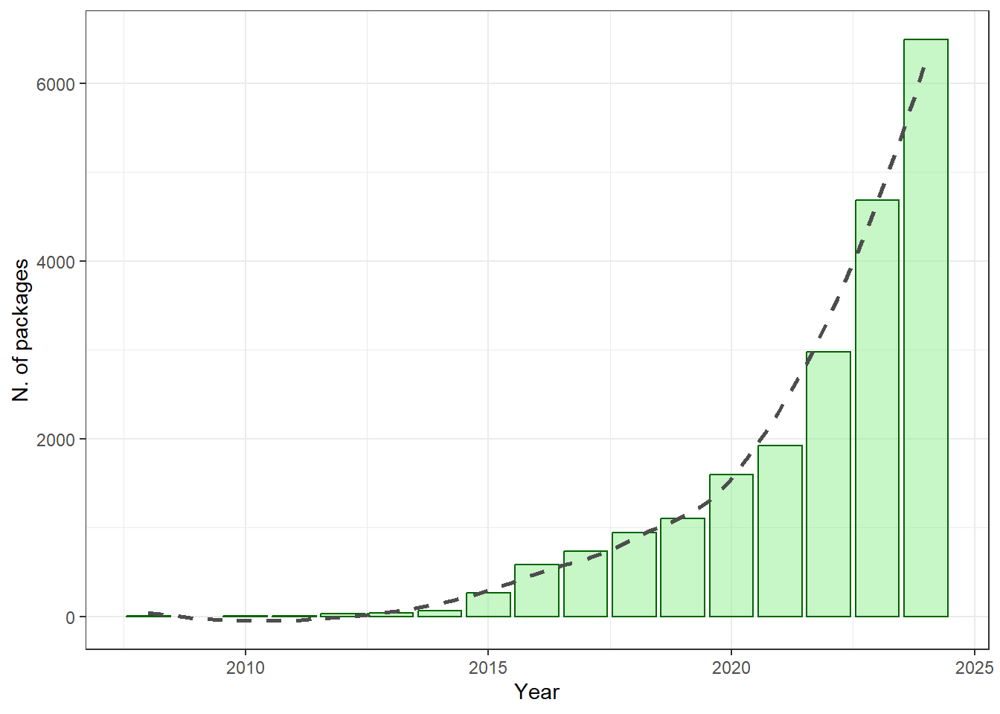

</figure>

The import and installation of new packages is carried out in 2 stages:

<ol type="1">
<li>
obtaining and installing and internal call to the package.
</li>
<li>
Loading the package into our session.
</li>
</ol>
</section>
<section id="installing-an-external-package" class="level3" data-number="2.9.4">
<h3 data-number="2.9.4" class="anchored" data-anchor-id="installing-an-external-package">2.9.4 Installing an external package</h3>

We will install the “foreign” package. This package provides functions for reading and writing data stored in different statistical software formats such as Minitab, S, SAS, SPSS, Stata, Systat … and to read and write <em>dBase</em> files such as attribute tables of vector layers in format <em>shapefile</em>. The first thing we will do is get the package via download. This can be done from the menu of R:

<ul>
<li>
Packages / Install packages …
</li>
<li>
Select download directory (mirror)
</li>
<li>
Search for “foreing”
</li>
</ul>

If you are using RStudio simply go to the <em>Packages</em> tab in the lower right box and select the <em>Install</em> option. In the popup window select the <em>Repository (CRAN, CRANextra)</em> option in the drop-down menu and type the name of the package.

<figure class="figure">

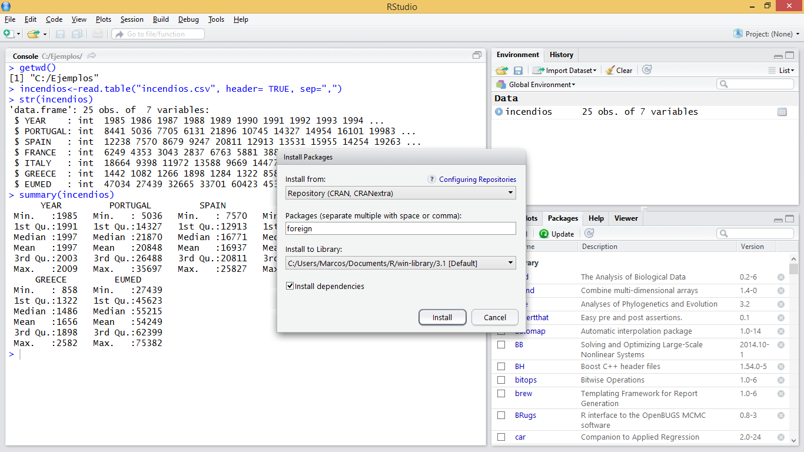

<figcaption>Installing a package using RStudio</figcaption>
</figure>

Another option is to obtain the package in <em>.zip</em> format directly from the webpage of project R and use the function <em>Install package (s) from local zip files …</em> (or <em>Package archives</em> in RStudio).

It is also possible to install packages through instructions in the R window, which is the most recommended method<a href="#fn7" class="footnote-ref" id="fnref7" role="doc-noteref">7</a>:

<pre class="sourceCode r code-with-copy"><code class="sourceCode r">install.packages("foreign")</code><button title="Copy to Clipboard" class="code-copy-button"><i class="bi"></i></button></pre>

At this point we would have installed the package in our personal library of R. However, in order to use the functions of the new package in our R environment it is necessary to make an internal call to the package. This is generally done using the&nbsp;<code>library()</code>&nbsp;function<a href="#fn8" class="footnote-ref" id="fnref8" role="doc-noteref">8</a>:

<pre class="sourceCode r code-with-copy"><code class="sourceCode r">library(foreign)</code><button title="Copy to Clipboard" class="code-copy-button"><i class="bi"></i></button></pre>

<pre><code>Warning: package 'foreign' was built under R version 4.3.3</code></pre>

Once this is done we have all the functions of the package ready to be used. All that is left is to learn how to use the functions of the package… which is easy to say but maybe not to do.

</section>
<section id="create-a-function" class="level3" data-number="2.9.5">
<h3 data-number="2.9.5" class="anchored" data-anchor-id="create-a-function">2.9.5 Create a function</h3>

So far we have mainly seen how to use pre-designed functions either in the default installation or from other packages. However, there is the possibility of creating our own functions.

A function is a group of instructions that takes an input or input data, and uses them to calculate other values, returning a result or product. For example, the <code>mean()</code> function takes as input a vector and returns as a result a numeric value that corresponds to the arithmetic mean.

To create our own functions we will use the object called function that constitute new functions. The usual syntax is:

<strong>💡FunName &lt;- function(args){comands} </strong>

Where:

<ul>
<li>
<code>arguments</code> are the arguments we want to pass to our function.
</li>
<li>
<code>commands</code> are the instructions needed to do whatever the function does.
</li>
</ul>

Let’s look at a simple example. We will create a function to calculate the <a href="https://en.wikipedia.org/wiki/Standard_deviation">standard deviation</a> of a vector with numerical data. The standard deviation formula looks like this:

\[
\text{SD} = \sqrt{\frac{1}{N} \sum_{i=1}^{N} (x_i - \bar{x})^2}
\]

Which is essentially the square root (<code>sqrt()</code>) of the variance (<code>var()</code>):

<pre class="sourceCode r code-with-copy"><code class="sourceCode r">desv &lt;- function(x){sqrt(var(x))}</code><button title="Copy to Clipboard" class="code-copy-button"><i class="bi"></i></button></pre>

The function name is&nbsp;<code>desv()</code>. This function requires a single argument (x) to be executed. Once the function is defined, it can be called and used as any other predefined function in the system.

<pre class="sourceCode r code-with-copy"><code class="sourceCode r">data &lt;- 1:10
desv(data)</code><button title="Copy to Clipboard" class="code-copy-button"><i class="bi"></i></button></pre>

<pre><code>[1] 3.02765</code></pre>

Let’s see an example with 2 arguments. We will create a function to calculate the NDVI. The function will take as arguments two objects of vector type corresponding to the sensor Landsat TM channels 3 and 4:

<i>The normalized difference vegetation index (NDVI) is a simple graphical indicator that can be used to analyze remote sensing measurements, typically but not necessarily from a space platform, and assess whether the target being observed contains live green vegetation or not&nbsp;<a href="https://en.wikipedia.org/wiki/Normalized_Difference_Vegetation_Index">wikipedia.org</a>.</i>

\[
NDVI=\frac{NIR-Red}{NIR+Red}
\]

Where&nbsp;\(NIR\)(<em>y</em>) is the near-infrarred band and&nbsp;\(Red\)(<em>x</em>) is the red band.

<pre class="sourceCode r code-with-copy"><code class="sourceCode r">ndvi &lt;- function(x,y){(y-x)/(y+x)}</code><button title="Copy to Clipboard" class="code-copy-button"><i class="bi"></i></button></pre>

As we have said, once created we can use our functions in the same way as the rest of functions. This includes using the <code>apply()</code> function and its derived versions to iterate over rows and columns of an array or data frame.

Let’s see an example with the function <code>desv()</code>, previously created applied to the data of number of fires:

<pre class="sourceCode r code-with-copy"><code class="sourceCode r">apply(fires,2,desv)</code><button title="Copy to Clipboard" class="code-copy-button"><i class="bi"></i></button></pre>

<pre><code>        YEAR     PORTUGAL        SPAIN       FRANCE        ITALY       GREECE 
    7.359801  9187.114305  5260.519400  1393.670265  3467.510729   496.662025 
       EUMED 
13547.393887 </code></pre>

</section>
</section>
<section id="plotting-with-r" class="level2" data-number="2.10">
<h2 data-number="2.10" class="anchored" data-anchor-id="plotting-with-r">2.10 Plotting with R</h2>
<section id="basic-plots" class="level3" data-number="2.10.1">
<h3 data-number="2.10.1" class="anchored" data-anchor-id="basic-plots">2.10.1 Basic plots</h3>

R is not just an environment for the implementation and use of functions for statistical calculation but it is also a powerful environment for generating and displaying plots. Creating plots is besides an effective and quick way to visualize our data. By doing so we can verify whether data was correctly imported or not. However, creating graphics is also done by command-line instructions, which can sometimes be a bit tricky, especially at the beginning.

In R we can create many types of plots. With some packages it is also possible to generate maps similar to those created by GIS, although for the moment we will only see some basic types such as:

<ul>
<li>
Dot charts
</li>
<li>
Line charts
</li>
<li>
Barplots
</li>
<li>
Histograms
</li>
<li>
Scatterplots
</li>
</ul>

Before going into detail with the specific types of graphics we will see some general concepts which apply to the majority of plots:

<ol type="1">
<li>
All graphics always require an object that contains the data to be drawn. This object is usually specified in the first argument of the function corresponding to each type of chart.
</li>
<li>
There are a number of arguments to manipulate axis labels or the chart title:
</li>
</ol>
<ul>
<li>
<code>main</code>: text with the title of our plot.
</li>
<li>
<code>xlab</code>: text for x axis label.
</li>
<li>
<code>ylab</code>: text for y axis label.
</li>
<li>
<code>xlim</code>: vector with upper and low range for the x-axis.
</li>
<li>
<code>ylim</code>: vector with upper and low range for the y-axis.
</li>
<li>
<code>cex</code>: number indicating the aspect ratio between plot elements and text. 1 by default.
</li>
<li>
<code>col</code>: changes de color the plotted element. See <a href="http://www.stat.columbia.edu/~tzheng/files/Rcolor.pdf" class="uri">http://www.stat.columbia.edu/~tzheng/files/Rcolor.pdf</a>
</li>
<li>
<code>legend()</code>: adds a legend element describing symbology.
</li>
</ul>
</section>
<section id="dot-or-point-plots" class="level3" data-number="2.10.2">
<h3 data-number="2.10.2" class="anchored" data-anchor-id="dot-or-point-plots">2.10.2 Dot or point plots</h3>

This is one of the most basic types of graphics if not the most basic one we can create. To create such a graph we will use the <code>plot()</code> function. Let’s look at a simple example using data from <em>fires.csv</em><a href="#fn9" class="footnote-ref" id="fnref9" role="doc-noteref">9</a>:

<pre class="sourceCode r code-with-copy"><code class="sourceCode r">par(mar=c(3.5, 3.5, 2, 1), mgp=c(2.4, 0.8, 0))
plot(fires$SPAIN)</code><button title="Copy to Clipboard" class="code-copy-button"><i class="bi"></i></button></pre>

<figure class="figure">

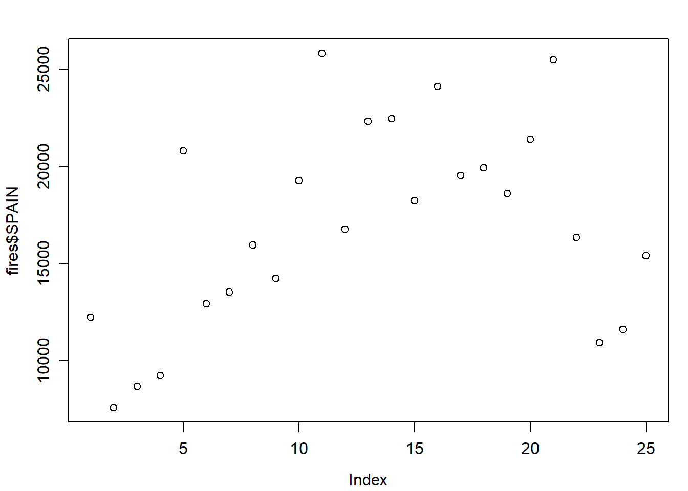

</figure>

As you can see, we are plotting data from the <em>SPAIN</em> column, ie, yearly fire occurrence data in Spain.

Remember RStudio displays plots in the right-bottom window. In addition, if you need to take closer look use the <em>Zoom</em> button to pop-up a new plot window.

Le’s tune up and enhance our plot. We can change the symbol type using the <code>pch</code> argument. You’ll find a list of symbol types (not just dot charts) at <a href="http://www.statmethods.net/advgraphs/parameters.html" class="uri">http://www.statmethods.net/advgraphs/parameters.html</a>.

<pre class="sourceCode r code-with-copy"><code class="sourceCode r">par(mar=c(3.5, 3.5, 2, 1), mgp=c(2.4, 0.8, 0))
plot(fires$SPAIN,pch=4)</code><button title="Copy to Clipboard" class="code-copy-button"><i class="bi"></i></button></pre>

<figure class="figure">

</figure>

We can change symbol size using&nbsp;<code>cex</code>:

<pre class="sourceCode r code-with-copy"><code class="sourceCode r">par(mar=c(3.5, 3.5, 2, 1), mgp=c(2.4, 0.8, 0))
plot(fires$SPAIN,pch=4,cex=2)</code><button title="Copy to Clipboard" class="code-copy-button"><i class="bi"></i></button></pre>

<figure class="figure">

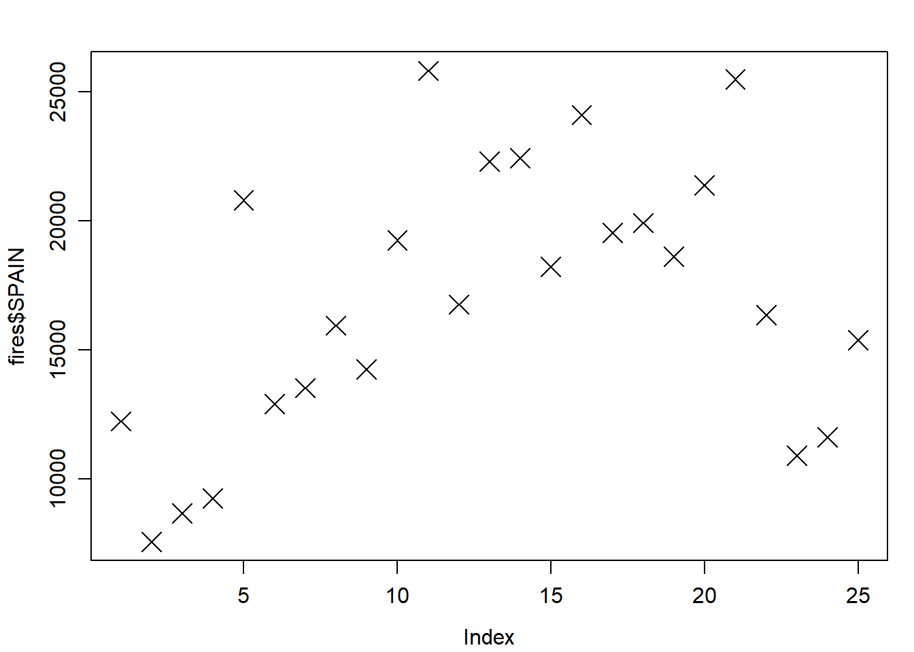

</figure>

And we can change the color of the symbol with <code>col</code>:

<pre class="sourceCode r code-with-copy"><code class="sourceCode r">par(mar=c(3.5, 3.5, 2, 1), mgp=c(2.4, 0.8, 0))
plot(fires$SPAIN,pch=4,cex=2,col='red')</code><button title="Copy to Clipboard" class="code-copy-button"><i class="bi"></i></button></pre>

<figure class="figure">

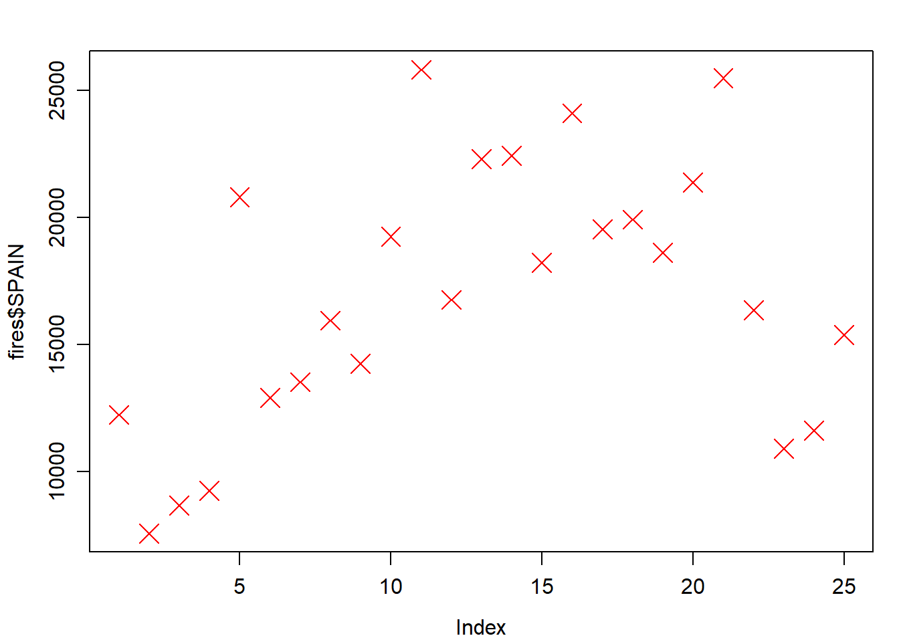

</figure>

The col argument can be specified either using the color name as in the example or using its code number, hexadecimal or RGB so that&nbsp;<code>col = 1</code>,&nbsp;<code>col = "white"</code>, and&nbsp;<code>col = "#FFFFFF"</code>&nbsp;are equivalent. In some types of symbols we can also change the color of the symbol background in addition to the symbol itself using the argument&nbsp;<code>bg</code>:

<pre class="sourceCode r code-with-copy"><code class="sourceCode r">par(mar=c(3.5, 3.5, 2, 1), mgp=c(2.4, 0.8, 0))
plot(fires$SPAIN,pch=21,cex=1,col='black',bg='red')</code><button title="Copy to Clipboard" class="code-copy-button"><i class="bi"></i></button></pre>

<figure class="figure">

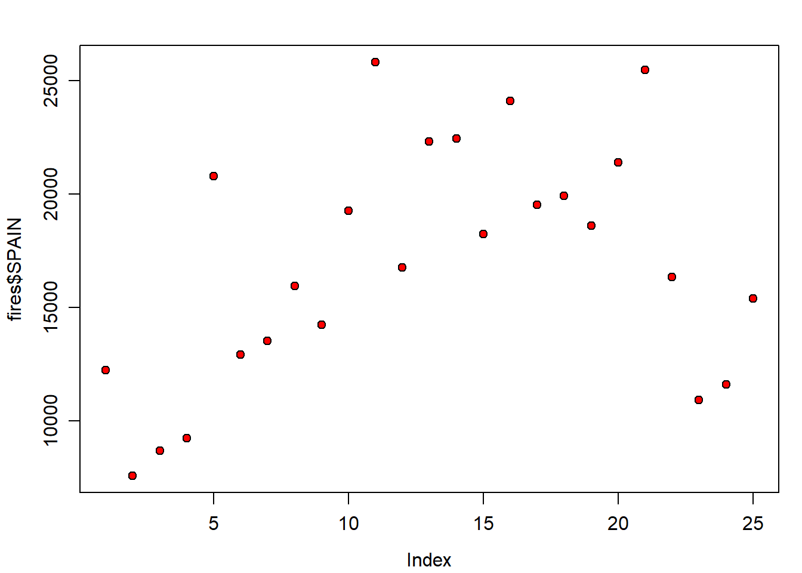

</figure>

The finish our plot we will modify axis labels, add a title and a legend:

<pre class="sourceCode r code-with-copy"><code class="sourceCode r">par(mar=c(3.5, 3.5, 2, 1), mgp=c(2.4, 0.8, 0))
plot(fires$SPAIN,pch=21,cex=1,col='black',bg='red',
     main='Number of fires in Spain',ylab = 'Number of fires',xlab = '')</code><button title="Copy to Clipboard" class="code-copy-button"><i class="bi"></i></button></pre>

<figure class="figure">

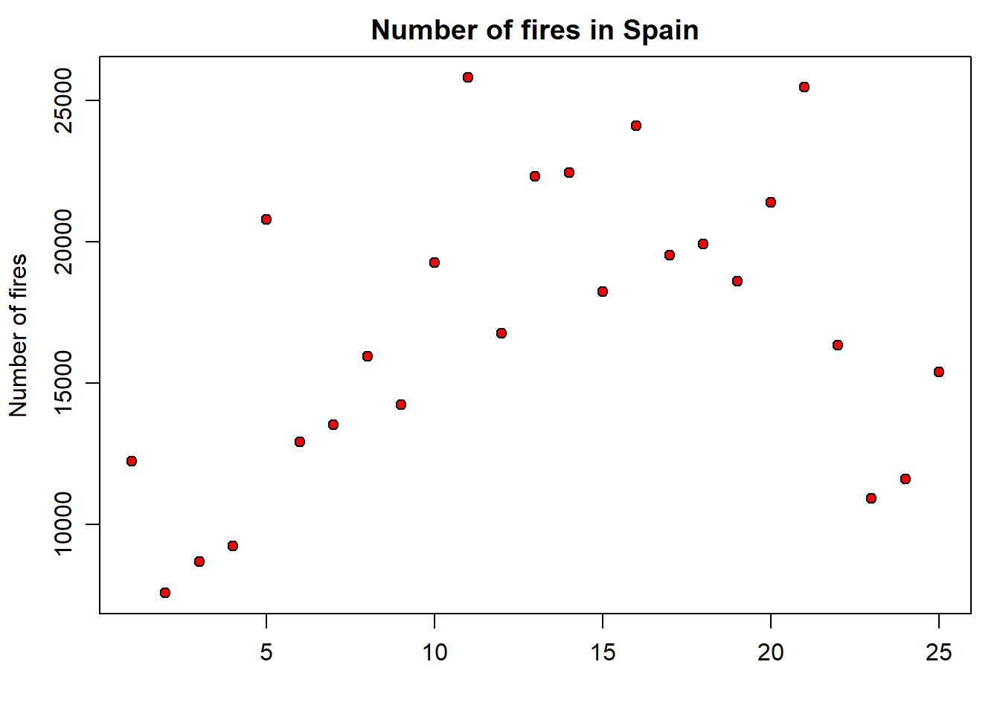

</figure>

Note that we have used the&nbsp;<code>xlab</code>&nbsp;argument to leave the x-axis label&nbsp;<em>blank</em>. Now we add the legend. It is important you bear in mind that the legend is added with an additional command right after the plot statement. Legends in basic plots are just an image we add to an existing plot by emulating the symbol used in that plot using the&nbsp;<code>legend()</code>&nbsp;function:

<pre class="sourceCode r code-with-copy"><code class="sourceCode r">par(mar=c(3.5, 3.5, 2, 1), mgp=c(2.4, 0.8, 0))
plot(fires$SPAIN,pch=21,cex=1,col='black',bg='red',
     main='Number of fires in Spain',ylab = 'Number of fires',xlab = '')
legend( "topleft" , cex = 1.3, bty = "n", legend = c("Spain"), , text.col = c("black"), col = c("red") , pt.bg = c("red") , pch = c(21) )</code><button title="Copy to Clipboard" class="code-copy-button"><i class="bi"></i></button></pre>

<figure class="figure">

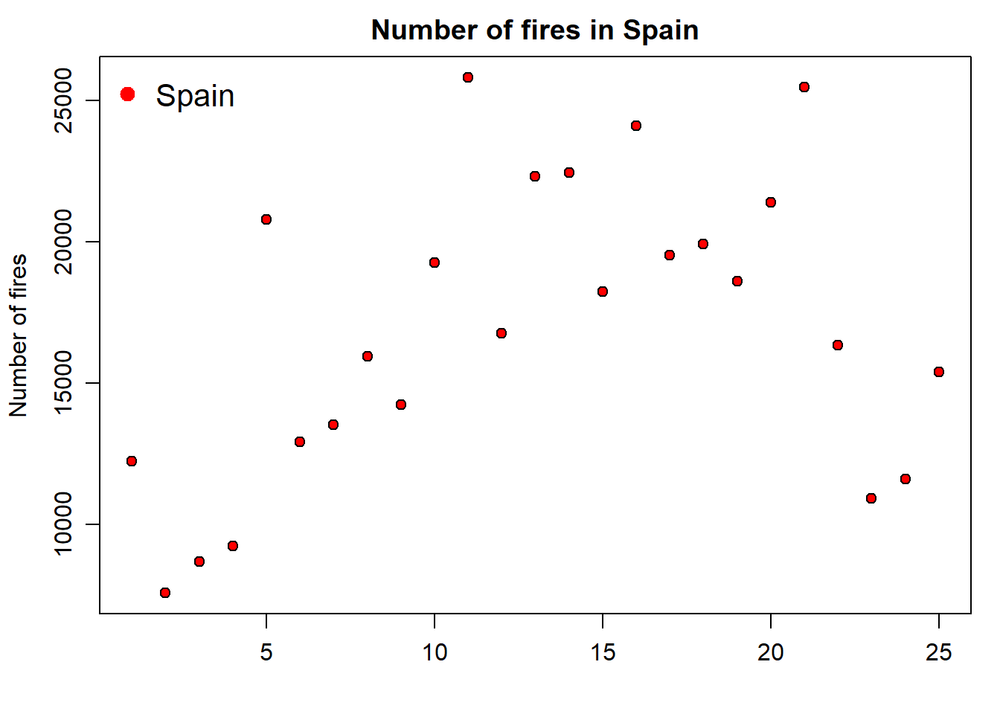

</figure>

But, what if we want to add a second series of data? Then we proceed in a way similar to the&nbsp;<code>legend()</code>&nbsp;statement, but using the function&nbsp;<code>points()</code>&nbsp;similar to what we have seen in the&nbsp;<code>plot()</code>&nbsp;example. In the following code we add a second point data series with portugal:

<pre class="sourceCode r code-with-copy"><code class="sourceCode r">par(mar=c(3.5, 3.5, 2, 1), mgp=c(2.4, 0.8, 0))
plot(fires$SPAIN,pch=21,cex=1,col='black',bg='red',
     main='Number of fires in Spain',ylab = 'Number of fires',xlab = '')
points(fires$PORTUGAL,pch=21,cex=1,col="blue",bg="blue")</code><button title="Copy to Clipboard" class="code-copy-button"><i class="bi"></i></button></pre>

<figure class="figure">

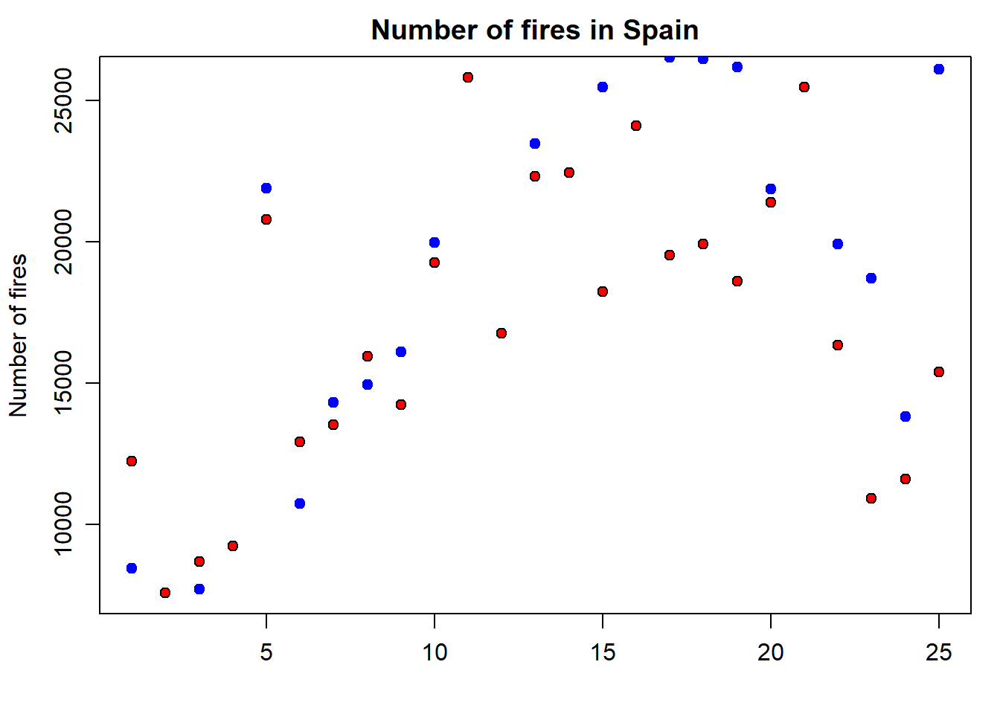

</figure>

Finally, we update the legend to fit the new plot with the second series of data. To do that we simply include a second value on each argument using a vector:

<pre class="sourceCode r code-with-copy"><code class="sourceCode r">par(mar=c(3.5, 3.5, 2, 1), mgp=c(2.4, 0.8, 0))
plot(fires$SPAIN,pch=21,cex=1,col='black',bg='red',
     main='Number of fires in Spain',ylab = 'Number of fires',xlab = '')
points(fires$PORTUGAL,pch=21,cex=1,col="blue",bg="blue")
legend( "topleft" , cex = 1.3, bty = "n", legend = c("Spain","Portugal"), , text.col = c("black"), col = c("red","blue") , pt.bg = c("red","blue") , pch = c(21) )</code><button title="Copy to Clipboard" class="code-copy-button"><i class="bi"></i></button></pre>

<figure class="figure">

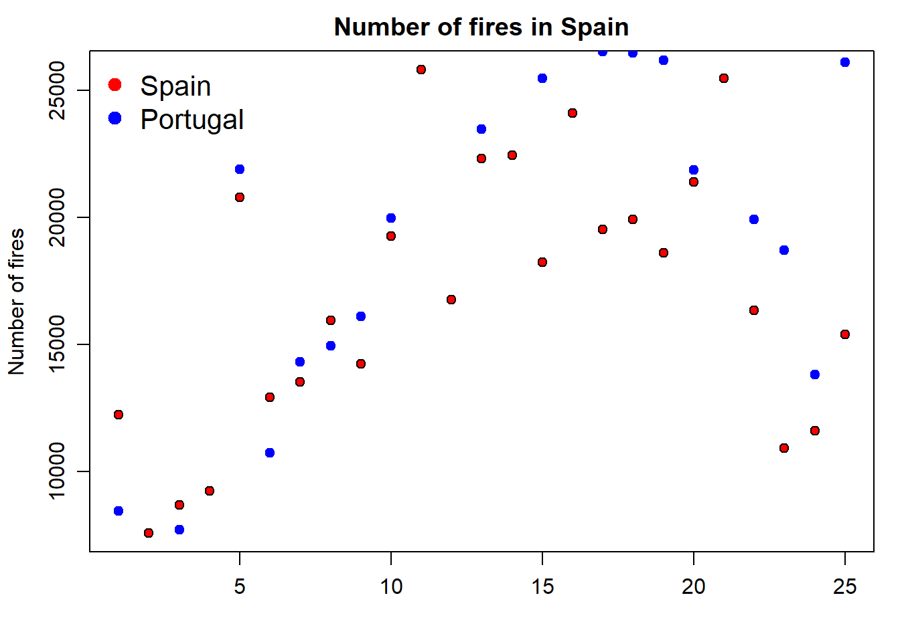

</figure>

The problem we are now experiencing is that data for Portugal doesn’t fit in the extent of the plot as it is. We should modify this using the&nbsp;<code>xlim</code>&nbsp;and&nbsp;<code>ylim</code>&nbsp;arguments. At this point x-axis works fine, so we’ll leave it as it is. The problem comes from y-axis. We can solve it by passing the&nbsp;<code>ylim</code>&nbsp;argument passing the minimum and maximum values of the&nbsp;<code>fires</code>&nbsp;data. We bring here some functions from&nbsp;<a href="#descriptive-statistics-and-summaries">Descriptive statistics and summaries</a>.

<pre class="sourceCode r code-with-copy"><code class="sourceCode r">par(mar=c(3.5, 3.5, 2, 1), mgp=c(2.4, 0.8, 0))
plot(fires$SPAIN,pch=21,cex=1,col='black',bg='red',
     main='Number of fires in Spain',ylab = 'Number of fires',xlab = '',
     ylim = c(min(fires[,2:6]),max(fires[,2:6])))
     
points(fires$PORTUGAL,pch=21,cex=1,col="blue",bg="blue")
legend( "topleft" , cex = 1.3, bty = "n", legend = c("Spain","Portugal"), , text.col = c("black"), col = c("red","blue") , pt.bg = c("red","blue") , pch = c(21) )</code><button title="Copy to Clipboard" class="code-copy-button"><i class="bi"></i></button></pre>

<figure class="figure">

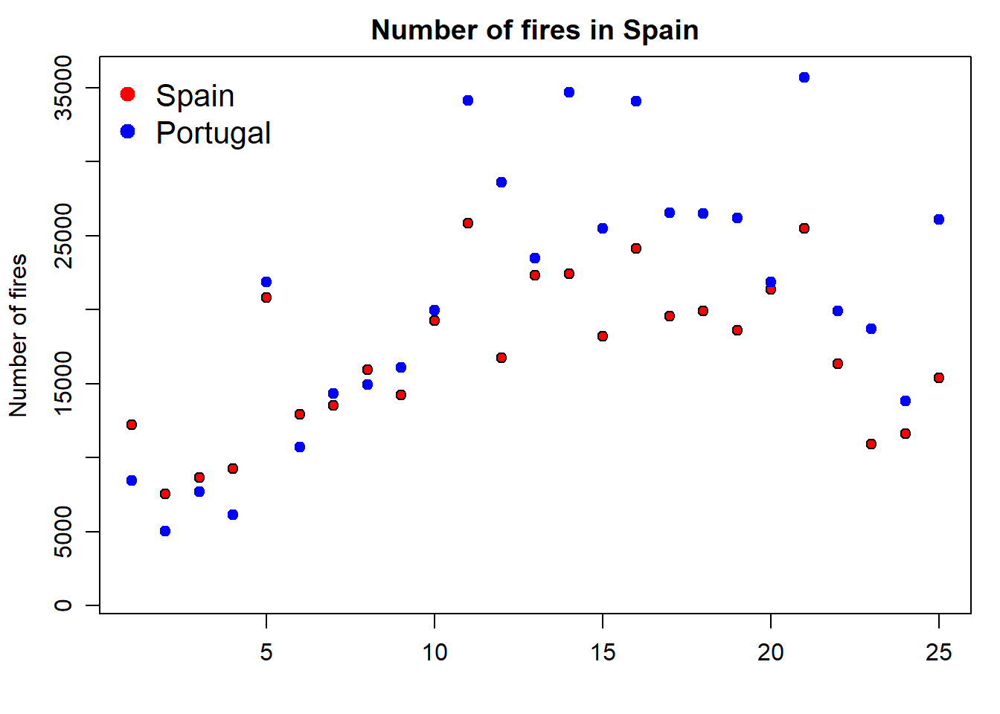

</figure>

<strong>📝EXERCISE 3: </strong> Explain in detail how the statement&nbsp;<code>ylim = c(min(fires[,2:6]),max(fires[,2:6]))</code>&nbsp;works in terms of the&nbsp;<code>max()</code>&nbsp;and&nbsp;<code>min()</code>&nbsp;functions and its interaction with the&nbsp;<code>fires</code>object.

<b>Deliverable: </b>

<ol type="1">
<li>Write a brief report describing the working procedure of the aforementioned instruction.</li>
</ol>

</section>
<section id="line-plots" class="level3" data-number="2.10.3">
<h3 data-number="2.10.3" class="anchored" data-anchor-id="line-plots">2.10.3 Line plots</h3>

Well, this is quite easy. In line plots we use lines to represent our data series instead of points which are the default symbol. How do we do that? Just adding an additionla argument to specify we want to use lines with <code>type = 'l'</code>:

<pre class="sourceCode r code-with-copy"><code class="sourceCode r">par(mar=c(3.5, 3.5, 2, 1), mgp=c(2.4, 0.8, 0))
plot(fires$SPAIN,pch=4,type='l',col='red')</code><button title="Copy to Clipboard" class="code-copy-button"><i class="bi"></i></button></pre>

<figure class="figure">

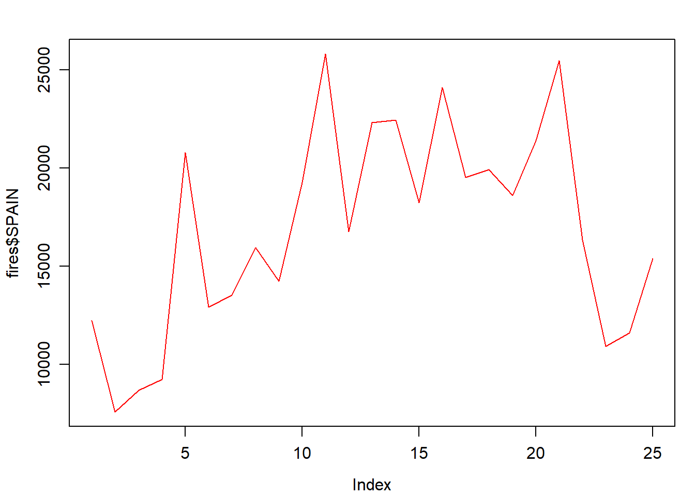

</figure>

Of course we can change the line&nbsp;<a href="http://www.statmethods.net/advgraphs/parameters.html">style</a>:

<pre class="sourceCode r code-with-copy"><code class="sourceCode r">par(mar=c(3.5, 3.5, 2, 1), mgp=c(2.4, 0.8, 0))
plot(fires$SPAIN,pch=4,type='l', lty=2, col='red')</code><button title="Copy to Clipboard" class="code-copy-button"><i class="bi"></i></button></pre>

<figure class="figure">

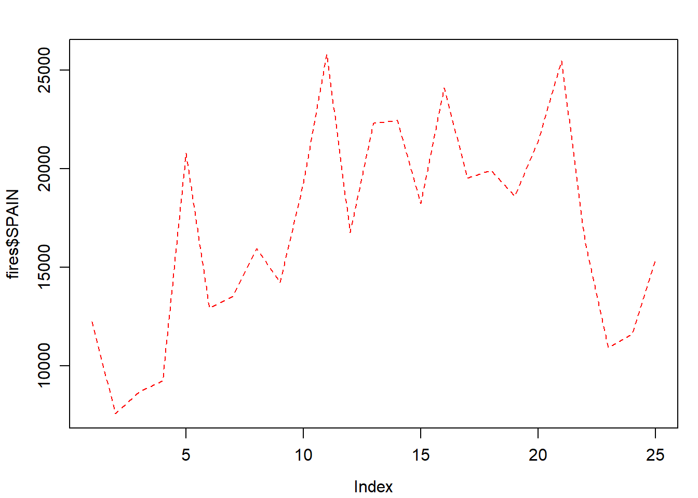

</figure>

Adding a second (or third, fourth,…,$n$) series is done with&nbsp;<code>lines()</code>:

<pre class="sourceCode r code-with-copy"><code class="sourceCode r">par(mar=c(3.5, 3.5, 2, 1), mgp=c(2.4, 0.8, 0))
plot(fires$SPAIN,pch=4,type='l', col='red',
     ylim = c(min(fires[,2:6]),max(fires[,2:6])))
lines(fires$PORTUGAL,cex=1,col="blue",lty=2)</code><button title="Copy to Clipboard" class="code-copy-button"><i class="bi"></i></button></pre>

<figure class="figure">

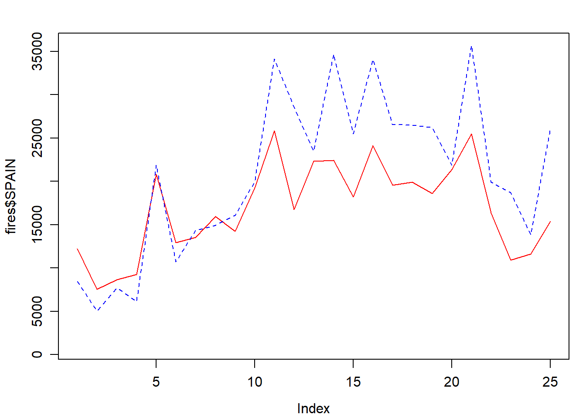

</figure>

We now adapt the legend and add some titles and we are good to go:

<pre class="sourceCode r code-with-copy"><code class="sourceCode r">par(mar=c(3.5, 3.5, 2, 1), mgp=c(2.4, 0.8, 0))
plot(fires$SPAIN,pch=4,type='l', col='red',
     main='Number of fires in Spain',ylab = 'Number of fires',xlab = '',
     ylim = c(min(fires[,2:6]),max(fires[,2:6])))
lines(fires$PORTUGAL,cex=1,col="blue",lty=2)

legend( "topleft" , cex = 1.3, , lty = c(1,2), legend = c("Spain","Portugal"), text.col = c("black"), col = c("red","blue"))</code><button title="Copy to Clipboard" class="code-copy-button"><i class="bi"></i></button></pre>

<figure class="figure">

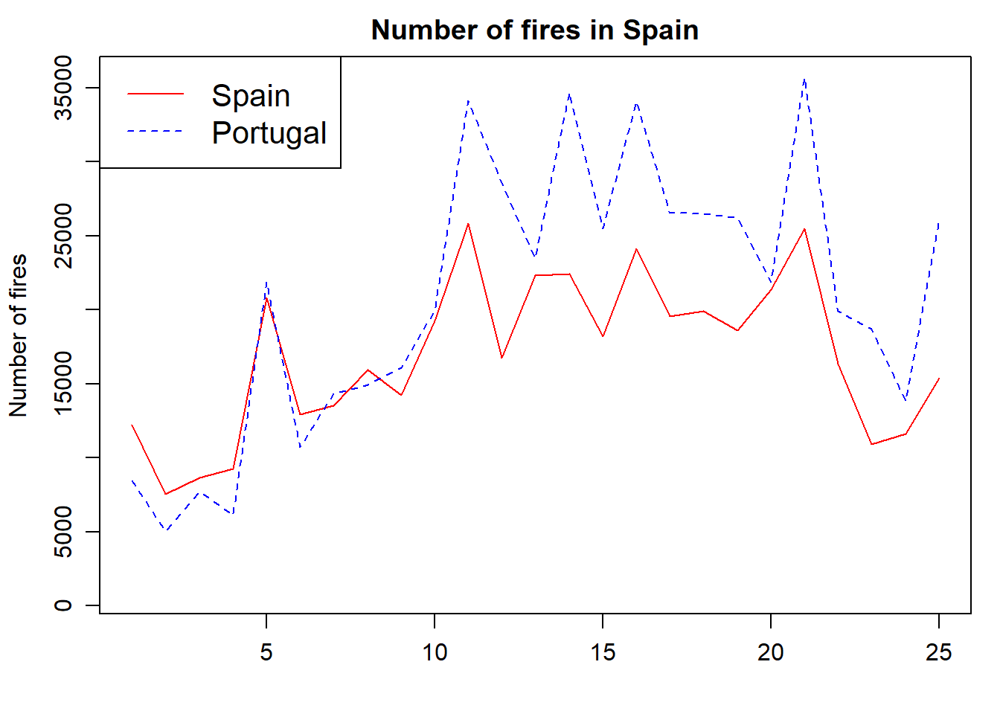

</figure>

</section>
<section id="histograms" class="level3" data-number="2.10.4">
<h3 data-number="2.10.4" class="anchored" data-anchor-id="histograms">2.10.4 Histograms</h3>

The next type of chart we will see is the frequency histogram. It is a bar chart that represents the number of elements of a sample (frequency) that we find within a certain range of values.

To draw this type of plot R uses the function <code>hist()</code>, which requires as a mandatory argument a vector (or column/row of an array) with the data to be represented. As with all other chart types we have seen, we can use <code>main,</code> <code>xlab</code>… Let’s see at an example using the example data from the <em>regression.txt</em> file<a href="#fn10" class="footnote-ref" id="fnref10" role="doc-noteref">10</a> (See Table 4.1):

<ul>
<li>
<strong>Tavg_max:</strong> maximum average temperature in June.
</li>
<li>
<strong>Tavg:</strong> average temperature in June.
</li>
<li>
<strong>long:</strong> longitude in UTM values EPSG:23030.
</li>
<li>
<strong>lot:</strong> latitude in UTM values EPSG:23030.
</li>
<li>
<strong>d_atl:</strong> distance in meters to the Atlantic sea.
</li>
<li>
<strong>d_medit:</strong> distance in meters to the Mediterranean sea.
</li>
<li>
<strong>elevation:</strong> elevation above sea level in meters.
</li>
</ul>

<pre class="sourceCode r code-with-copy"><code class="sourceCode r">hist(regression$elevation)</code><button title="Copy to Clipboard" class="code-copy-button"><i class="bi"></i></button></pre>

<figure class="figure">

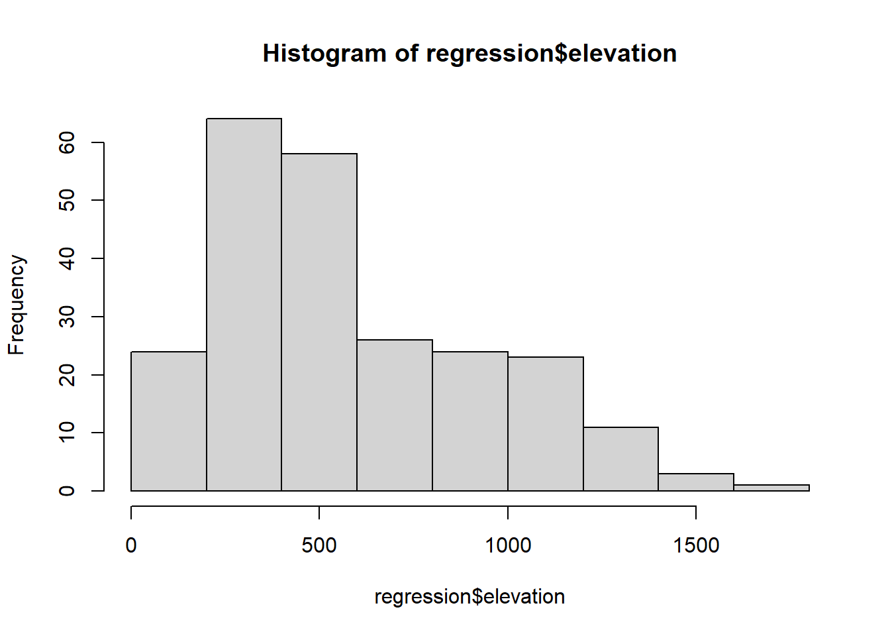

</figure>

Then we use the arguments we have seen to customize the plot:

<pre class="sourceCode r code-with-copy"><code class="sourceCode r">hist(regression$elevation,breaks=15,main="Elevation frecuency distribution",xlab="Elevation",ylab="Frecuency",col="blue",border="white",ylim=c(0,40),xlim=c(0,2000))</code><button title="Copy to Clipboard" class="code-copy-button"><i class="bi"></i></button></pre>

<figure class="figure">

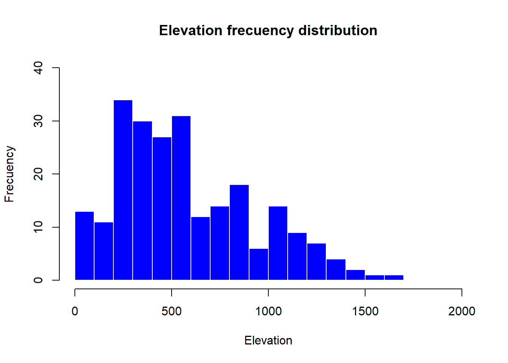

</figure>

The only new parameters are:

<ul>
<li>
<code>breaks</code>, used to specify the number of bars in the <code>histrogram</code>.
</li>
<li>
<code>border</code>, used the change the color of bar’s borders.
</li>
</ul>
</section>
<section id="scatterplots" class="level3" data-number="2.10.5">
<h3 data-number="2.10.5" class="anchored" data-anchor-id="scatterplots">2.10.5 Scatterplots</h3>

So far we have seen how to construct univariate graphs, ie, represent a single variable or data series. Next we will see a type of bivariate graph, the scatterplot. This type of chart is interesting to visualize relations between two variables, almost mandatory to explore correlation or collinearity in regression analysis. Let’s look at an example with our fire data.

In this case we introduce in the function <code>plot()</code> a second data argument (\(y\)) with a second vector with the data right after the first data argument (\(x\)):

<pre class="sourceCode r code-with-copy"><code class="sourceCode r">plot(regression$Tavg,regression$elevation)</code><button title="Copy to Clipboard" class="code-copy-button"><i class="bi"></i></button></pre>

<figure class="figure">

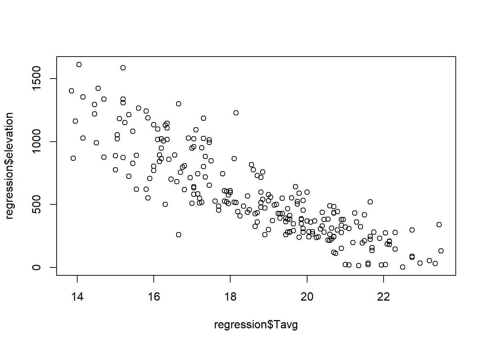

</figure>

Note that the first data series goes to \(x-axis\) and the second to the&nbsp;\(y\). Again, we can customize the appearnce and symbols similar to the regural do plot:

<pre class="sourceCode r code-with-copy"><code class="sourceCode r">plot(regression$elevation, regression$Tavg,
     main='Average temperature vs elevation',ylab = 'Temperature (Celsius)', xlab = 'Elevation (m)',
     pch=21, col='black', bg='steelblue')</code><button title="Copy to Clipboard" class="code-copy-button"><i class="bi"></i></button></pre>

<figure class="figure">

</figure>

A particularly useful function in combination with&nbsp;<code>scatterplots</code>&nbsp;is&nbsp;<code>abline()</code>&nbsp;which allows to incorporate a&nbsp;<em>trend line</em>&nbsp;to the plot. We will further explore this later.

<pre class="sourceCode r code-with-copy"><code class="sourceCode r">plot(regression$elevation, regression$Tavg,
     main='Average temperature vs elevation',ylab = 'Temperature (Celsius)', xlab = 'Elevation (m)',
     pch=21, col='black', bg='steelblue')
abline(lm(regression$Tavg~regression$elevation), lty=2, col='gray20',lwd=3)</code><button title="Copy to Clipboard" class="code-copy-button"><i class="bi"></i></button></pre>

<figure class="figure">

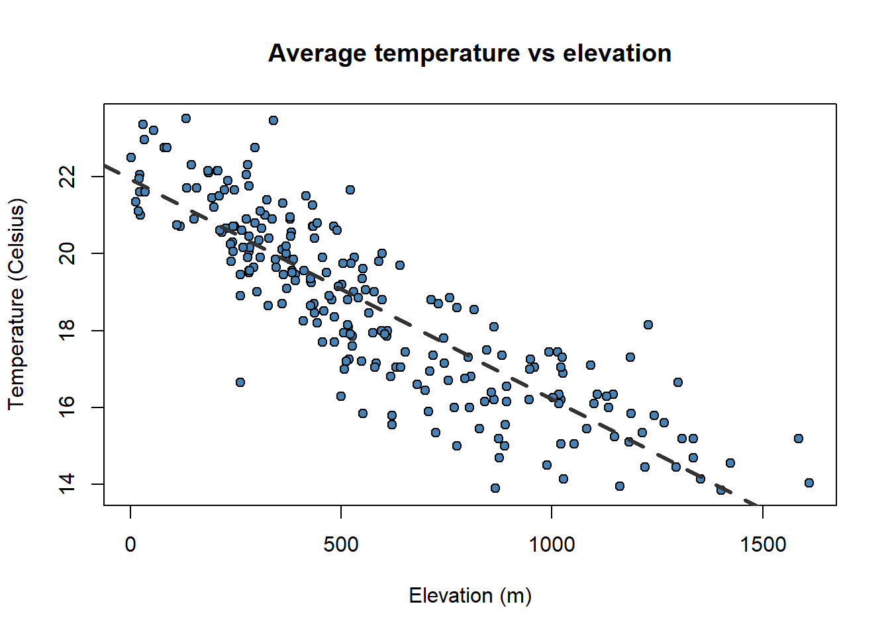

</figure>

Pay attention to the order in which we have introduced the \(x\) and \(y\) data in&nbsp;<code>plot()</code>&nbsp;and&nbsp;<code>abline()</code>. It is the opposite!!.

</section>
<section id="multiple-plots" class="level3" data-number="2.10.6">
<h3 data-number="2.10.6" class="anchored" data-anchor-id="multiple-plots">2.10.6 Multiple plots</h3>

To finish with plot creation we will see two last possibilities. The first one is how to combine several charts in a single figure and the second how to export an image file from our graphics.

<section id="create-a-combined-plot" class="level4" data-number="2.10.6.1">
<h4 data-number="2.10.6.1" class="anchored" data-anchor-id="create-a-combined-plot">2.10.6.1 Create a combined plot</h4>

Combining several graphs in R is possible thanks to the function <code>par(mfrow = c(rows, columns))</code>. Using this function we prepare the display window to include several graphs simultaneously:

<pre class="sourceCode r code-with-copy"><code class="sourceCode r">par(mfrow = c(2, 1),mar=c(3.5, 3.5, 2, 1), mgp=c(2.4, 0.8, 0))
plot(fires$SPAIN,pch=4,type='l', col='red',
     ylim = c(min(fires[,2:6]),max(fires[,2:6])))
plot(fires$PORTUGAL,type='l',col="blue",lty=2,
     ylim = c(min(fires[,2:6]),max(fires[,2:6])))</code><button title="Copy to Clipboard" class="code-copy-button"><i class="bi"></i></button></pre>

<figure class="figure">

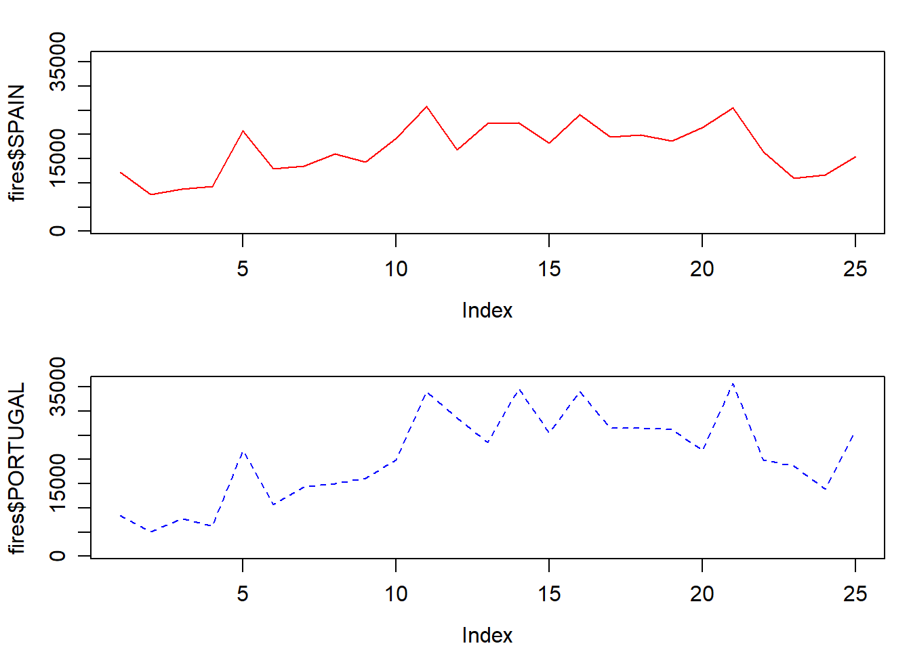

</figure>

</section>
</section>
<section id="export-an-image-file" class="level3" data-number="2.10.7">
<h3 data-number="2.10.7" class="anchored" data-anchor-id="export-an-image-file">2.10.7 Export an image file</h3>

Since R runs on so many different operating systems, and supports so many different graphics formats, it’s not surprising that there are a variety of ways of saving your plots, depending on what operating system you are using, what you plan to do with the graph, and whether you’re connecting locally or remotely.

The first step in deciding how to save plots is to decide on the output format that you want to use. The following table lists some of the available formats, along with guidance as to when they may be useful.

Here’s a general method<a href="#fn11" class="footnote-ref" id="fnref11" role="doc-noteref">11</a> that will work on any computer with R, regardless of operating system or the way that you are connecting.

<ol type="1">
<li>
Choose the format that you want to use. In this example, I’ll save a plot as a JPG file, so I’ll use the jpeg driver.
</li>
<li>
The only argument that the device drivers need is the name of the file that you will use to save your graph. Remember that your plot will be stored relative to the current directory. You can find the current directory by typing <code>getwd()</code> at the R prompt. You may want to make adjustments to the size of the plot before saving it. Consult the help file for your selected driver to learn how.
</li>
<li>
Now enter your plotting commands as you normally would. You will not actually see the plot - the commands are being saved to a file instead.
</li>
<li>
When you’re done with your plotting commands, enter the <code>dev.off()</code> command. This is very important - without it you’ll get a partial plot or nothing at all. So if we wanted to save a jpg file called “rplot.jpg” containing a plot of x and y, we would type the following commands:
</li>
</ol>

<pre class="sourceCode r code-with-copy"><code class="sourceCode r">jpeg('rplot.jpg', width = 800, height = 600, res=100)

# Here goes the plot
par(mfrow = c(2,1),mar=c(3.5, 3.5, 2, 1), mgp=c(2.4, 0.8, 0))
plot(fires$SPAIN,pch=4,type='l', col='red',
     ylim = c(min(fires[,2:6]),max(fires[,2:6])))
plot(fires$PORTUGAL,type='l',col="blue",lty=2,
     ylim = c(min(fires[,2:6]),max(fires[,2:6])))

dev.off()</code><button title="Copy to Clipboard" class="code-copy-button"><i class="bi"></i></button></pre>

<pre><code>png 
  2 </code></pre>

</section>
</section>
</section>
<section id="final-words-of-module-1" class="level1 unnumbered">
<h1 class="unnumbered">Final Words of module 1</h1>

Before finishing the module we would like to give you some insights into the main concepts you should have become familiar with.

<ol type="1">
<li>
You must have mastered object creation and manipulation, mainly table-like objects (<code>array</code> and <code>data.frame</code>) and vectors.
</li>
<li>
It is not that important to remember the specific syntax of the functions we have covered here but to realize the we can combine objects with function arguments.
</li>
<li>
We can create scripts to do specific tasks, we do not need to insert instructions one by one manually.
</li>
</ol>
<section id="references" class="level2 unnumbered">
<h2 class="unnumbered anchored" data-anchor-id="references">References</h2>

R Core Team. 2021. <em>R: A Language and Environment for Statistical Computing</em>. Vienna, Austria: R Foundation for Statistical Computing. <a href="https://www.r-project.org/">https://www.R-project.org/</a>.

</section>
</section>

<section id="footnotes" class="footnotes footnotes-end-of-document" role="doc-endnotes"><h2 class="anchored quarto-appendix-heading">Footnotes</h2>

<ol>
<li id="fn1">
This is probably the most useful one. The IDE will suggest the function name instead of fully typing it<a href="https://intro-r-module-1.netlify.app/intro#fnref1">↩︎</a><a href="#fnref1" class="footnote-back" role="doc-backlink">↩︎</a>
</li>
<li id="fn2">
Just for the record, this is my favourite one<a href="https://intro-r-module-1.netlify.app/intro#fnref2">↩︎</a><a href="#fnref2" class="footnote-back" role="doc-backlink">↩︎</a>
</li>
<li id="fn3">
Do not mistake it with the R vector object, they are quite different!<a href="#fnref3" class="footnote-back" role="doc-backlink">↩︎</a>
</li>
<li id="fn4">
use&nbsp;<code>\t</code>&nbsp;for tab<a href="#fnref4" class="footnote-back" role="doc-backlink">↩︎</a>
</li>
<li id="fn5">
the same applies for&nbsp;<code>dec</code><a href="#fnref5" class="footnote-back" role="doc-backlink">↩︎</a>
</li>
<li id="fn6">
Remember to adapt the path to your own folder structure<a href="#fnref6" class="footnote-back" role="doc-backlink">↩︎</a>
</li>
<li id="fn7">
Do not forget quotes sorrounding the name of the package<a href="#fnref7" class="footnote-back" role="doc-backlink">↩︎</a>
</li>
<li id="fn8">
Note that quotes are not needed<a href="#fnref8" class="footnote-back" role="doc-backlink">↩︎</a>
</li>
<li id="fn9">
please, ignore the&nbsp;<code>par()</code>&nbsp;statement at this time<a href="#fnref9" class="footnote-back" role="doc-backlink">↩︎</a>
</li>
<li id="fn10">
Remember to import the file properly, setting the adequate parameters for field and decimal separator<a href="#fnref10" class="footnote-back" role="doc-backlink">↩︎</a>
</li>
<li id="fn11">
Taken from&nbsp;<a href="https://www.stat.berkeley.edu/classes/s133/saving.html" class="uri">https://www.stat.berkeley.edu/classes/s133/saving.html</a><a href="#fnref11" class="footnote-back" role="doc-backlink">↩︎</a>
</li>
</ol>
</section>
</main> <!-- /main -->

 <!-- /content -->

</body></html>
